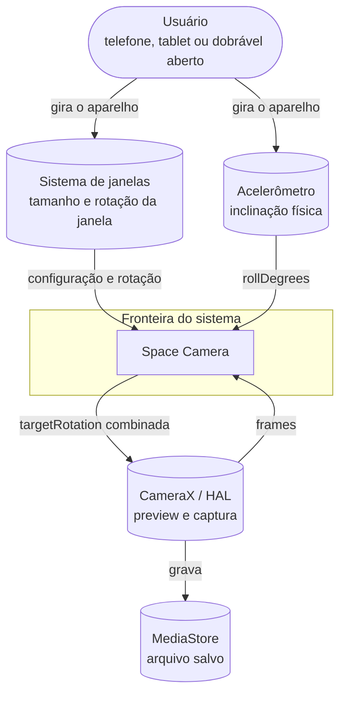
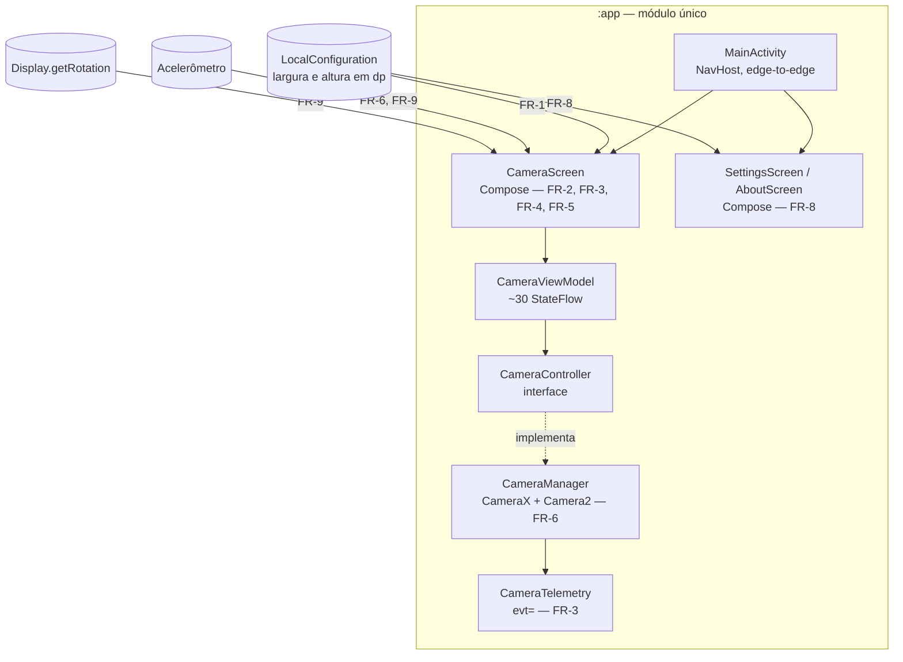
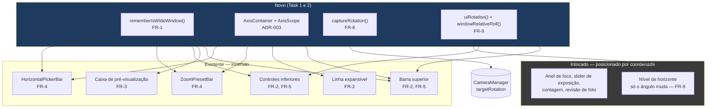
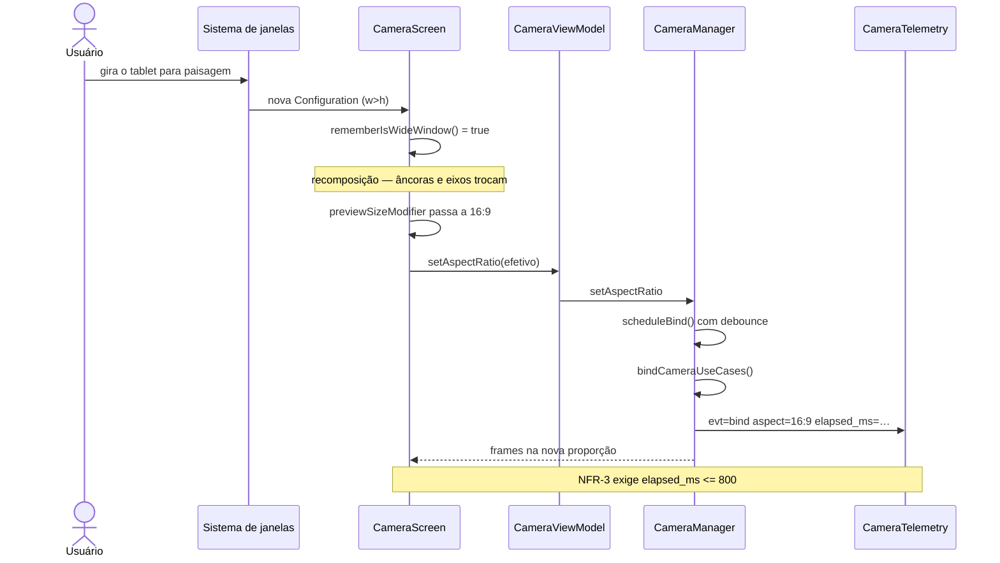
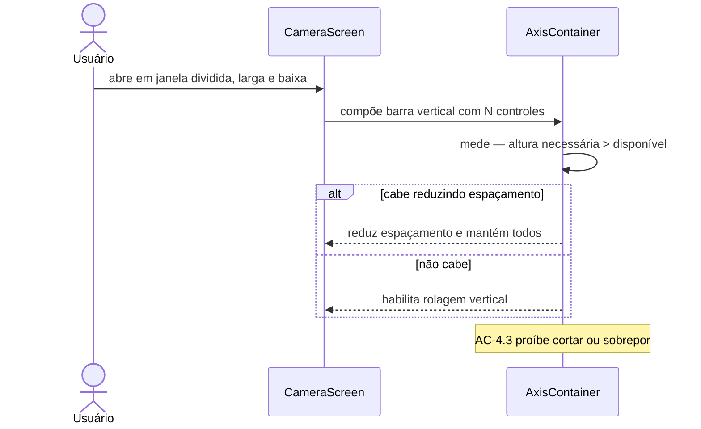
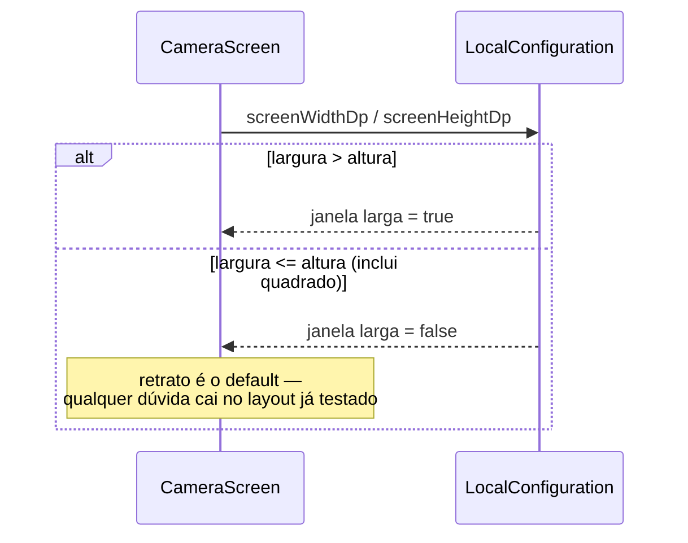

# Design — Layout Adaptativo

## 1. Contexto (C4 nível 1)

A mudança é interna à camada de apresentação. Nenhum sistema externo entra ou sai —
o que muda é que o sistema de janelas passa a entregar janelas largas, e o CameraX
passa a precisar de uma rotação calculada de forma diferente.



O acelerômetro e o sistema de janelas aparecem como **fontes distintas** de
propósito, mas o motivo é o inverso do que se supôs no Gate 2: enquanto a janela é
livre, as duas **medem a mesma grandeza**. Somá-las é o defeito que a Q-01 achou. O
acelerômetro sozinho serve a captura (FR-6); a diferença entre os dois serve a UI
(FR-9).

**Requisitos:** FR-1, FR-6, FR-9

---

## 2. Containers (C4 nível 2)

Nada de novo é criado. O diagrama mostra onde os requisitos incidem sobre a
estrutura que já existe.



**Requisitos:** FR-1, FR-2, FR-3, FR-4, FR-5, FR-6, FR-8

---

## 3. Componentes (C4 nível 3)

Detalhe interno da `CameraScreen`. Em azul, o que é novo; o resto já existe e só
muda de eixo.



O bloco "intocado" é a razão de a spec ser pequena: os overlays não precisam de
mudança porque já se posicionam por coordenada absoluta. O nível é a única exceção, e
só no ângulo da linha — a posição continua por coordenada.

Note que [ROT] e [UIR] apontam para lugares diferentes: a rotação de captura vai para
o `CameraManager`, a compensação vai para a UI. Confundi-las é o defeito da Q-01.

**Requisitos:** FR-1, FR-2, FR-3, FR-4, FR-5, FR-6, FR-9

---

## 4. Layout resultante

### Retrato — inalterado

```
┌────────────────────────┐
│  HD30  EIS  ⚡  ⏱  ⌄   │  ← align(TopCenter) + Row
├────────────────────────┤
│                        │
│    PRÉ-VIS  9:16       │  ← Box centralizado
│                        │
├────────────────────────┤
│      1×  2×  5×        │  ← ZoomPresetBar (Row)
│       Vídeo  Foto      │
│    ↺      ●      ▣     │  ← align(BottomCenter) + Column
└────────────────────────┘
```

### Paisagem — eixo invertido

```
┌──────┬──────────────────────────┬──────┐
│ HD30 │                          │  1×  │
│ EIS  │                          │  2×  │
│  ⚡   │    PRÉ-VIS  16:9         │  5×  │
│  ⏱   │                          │ V/F  │
│  ⌄   │                          │  ●   │
│      │                          │ ↺  ▣ │
└──────┴──────────────────────────┴──────┘
  ↑ CenterStart + Column          ↑ CenterEnd + Column
```

Os ícones continuam girando pelo acelerômetro, como hoje — em tablet apoiado na
mesa `rollDegrees ≈ 0` e eles ficam na vertical, corretos.

---

## 5. Diagramas de sequência

### 5.1 Mudança de orientação — caminho feliz



### 5.2 As duas grandezas que saem do mesmo sensor

**Revisado em 2026-08-04 (Q-01).** A versão anterior deste diagrama mostrava a rotação
de captura como soma do sensor e da janela. A medição refutou: enquanto a janela
acompanha o aparelho, as duas fontes são a mesma grandeza. Quem precisa da rotação da
janela é a UI.

```mermaid
sequenceDiagram
    actor U as Usuário
    participant A as Acelerômetro
    participant CS as CameraScreen
    participant D as Display
    participant CM as CameraManager
    participant MS as MediaStore

    A->>CS: rollDegrees (inclinação física)
    CS->>D: getRotation() — quanto o compositor já girou
    Note over CS,D: janela livre: getRotation() == inclinação física<br/>janela travada: getRotation() fica em ROTATION_0

    rect rgb(30, 58, 95)
        Note over CS: FR-9 — compensação da UI
        CS->>CS: uiRotation = snap(roll − janela)
        CS->>CS: windowRelativeRoll = roll − janela (contínuo, nível)
    end

    rect rgb(58, 58, 58)
        Note over CS: FR-6 — captura, só o sensor
        CS->>CS: captureRotation = snap(roll)
    end

    U->>CS: toca em gravar
    CS->>CM: startRecording(targetRotation = captureRotation)
    CM->>MS: grava MP4 com metadado de rotação
    MS-->>U: cena de pé — horizonte na horizontal
    Note over MS: AC-6.2 confere no arquivo, não na tela
```



Fórmula do CameraX confirmada por dois pontos medidos:
`rotação de saída = (SENSOR_ORIENTATION − targetRotation) mod 360`.

### 5.3 Falha — janela larga sem altura suficiente



### 5.4 Falha — Configuration ausente ou degenerada



O desempate do quadrado favorecer retrato não é detalhe: garante que qualquer valor
inesperado leve ao layout que tem cobertura de teste (AC-1.3, NFR-1).

---

## 6. Diagrama de implantação (C4 nível 4)

**Dispensado.** Não há topologia de implantação: é um app Android de módulo único,
instalado por APK, sem back-end nem múltiplos ambientes. A spec não altera
empacotamento, assinatura nem distribuição. Registrado conforme §8.6 da skill, que
permite dispensar para casos sem infraestrutura.

---

## 7. Estratégia de teste

| Requisito | Como se verifica | Onde |
|---|---|---|
| FR-1 | Testes de tabela do predicado com pares largura/altura | JVM |
| FR-6 | Testes de quadrante + fronteira, e inspeção do arquivo salvo | JVM + aparelho |
| FR-9 | Testes de tabela das 16 combinações + captura de tela nos dois AVDs | JVM + aparelho |
| FR-2, FR-4 | Inspeção visual comparada, retrato e paisagem | Emulador |
| FR-3 | `evt=bind` mostra `aspect` correto | `scripts/logcat.sh 'evt=bind'` |
| FR-5, NFR-2 | Cálculo de contraste sobre captura com cena branca | Emulador + medição |
| FR-7 | `dumpsys` mostra a activity ocupando a janela inteira | Tablet |
| NFR-1 | 38 testes atuais passando + captura comparada em telefone | JVM + emulador |
| NFR-3 | `elapsed_ms` do `evt=bind` após girar | `scripts/logcat.sh` |
| NFR-5 | `wc -l CameraScreen.kt` ≤ 2.240 | Comando |

FR-1, FR-6 e FR-9 são deliberadamente funções puras justamente para caírem na JVM — é
o que o NFR-4 cobra. O resto exige olho ou aparelho, e está reconhecido como tal.

Limite conhecido dessa cobertura, medido em 2026-08-04: a primeira ligação do FR-9
passou nos 12 testes de tabela e não funcionou no aparelho, porque `view.display` é
nulo até a View ser anexada e a leitura ficava congelada. Função pura correta não
garante ligação correta — por isso FR-6 e FR-9 aparecem como `JVM + aparelho`.
