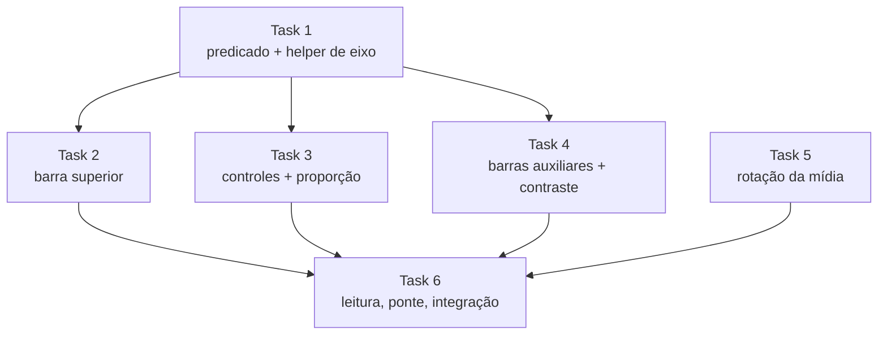

# Tarefas — Layout Adaptativo

## Visão geral

- **Total:** 6
- **Concluídas:** 0
- **Em andamento:** 0
- **Pendentes:** 6
- **Estratégia de decomposição:** fatias verticais por grupo de controle. A Task 1 é
  contrato de Wave 0 (predicado + helper de eixo), do qual quatro tarefas dependem —
  extraí-lo evita que virem uma corrente serial. A Task 5 (orientação da mídia) é
  ortogonal e pode correr desde o início.

---

### [ ] 1. Predicado de janela larga e helper de eixo

Contrato de Wave 0. Existe separado porque quatro tarefas dependem dele.

- **Size:** S
- **Complexity:** medium
- **Risk:** low
- **Dependencies:** nenhuma
- **Steps:**
  1. Criar `rememberIsWideWindow(): Boolean` lendo `LocalConfiguration`. Extrair a
     comparação para a função pura `isWideWindow(widthDp: Int, heightDp: Int): Boolean`
     para poder testar na JVM.
  2. Criar `AxisScope` expondo `Modifier.axisWeight(weight: Float)`, delegando a
     `RowScope.weight` ou `ColumnScope.weight` conforme o eixo concreto.
  3. Criar `AxisContainer(vertical: Boolean, ...)` que instancia `Row` ou `Column` e
     fornece o `AxisScope`.
  4. Converter `RowScope.TopBarSlot` em `AxisScope.TopBarSlot`, usando `axisWeight`.
- **Acceptance Criteria:**
  - **DADO** 411×891 **QUANDO** o predicado roda **ENTÃO** retorna falso
  - **DADO** 1280×800 **QUANDO** o predicado roda **ENTÃO** retorna verdadeiro
  - **DADO** 800×800 **QUANDO** o predicado roda **ENTÃO** retorna falso
  - **DADO** `AxisContainer(vertical = false)` **QUANDO** composto **ENTÃO** produz
    layout idêntico ao `Row` que substituiu
- **Verification:**
  - [ ] Testes passam: `./gradlew testDebugUnitTest --tests '*WideWindow*'`
  - [ ] Build: `./gradlew assembleDebug`
  - [ ] Manual: o app em telefone continua idêntico (nada consome o predicado ainda)
- **_Requirements: FR-1, NFR-4_**
- **_Decisions: ADR-002, ADR-003_**

---

### [ ] 2. Inverter a barra superior

- **Size:** M
- **Complexity:** medium
- **Risk:** medium
- **Dependencies:** Task 1
- **Steps:**
  1. Trocar o container da barra superior por `AxisContainer(vertical = isWide)`.
  2. Trocar `align(Alignment.TopCenter)` por `CenterStart` quando `isWide`, e
     `fillMaxWidth()` por `fillMaxHeight()`.
  3. Aplicar o mesmo à linha expansível (NR, HDR, mic, grade, configurações).
  4. Trocar o inset de `safeDrawing.only(Top)` para `only(Start)` quando `isWide`.
  5. Aplicar o fundo de contraste do FR-5 ao grupo (valor definido na Task 4).
- **Acceptance Criteria:**
  - **DADO** janela larga **QUANDO** a tela compõe **ENTÃO** a barra fica no bordo
    esquerdo, empilhada verticalmente
  - **DADO** janela em retrato **QUANDO** a tela compõe **ENTÃO** a barra fica no topo,
    igual a antes
  - **DADO** recorte de câmera na lateral **QUANDO** em paisagem **ENTÃO** a barra não
    fica por baixo dele
- **Verification:**
  - [ ] Testes passam: `./gradlew testDebugUnitTest`
  - [ ] Manual: `scripts/smoke.sh` em telefone, captura comparada com a de hoje
  - [ ] Manual: girar o tablet e conferir a barra à esquerda
- **_Requirements: FR-2, FR-5, NFR-1_**
- **_Decisions: ADR-001, ADR-003_**

---

### [ ] 3. Inverter os controles inferiores e a proporção da pré-visualização

- **Size:** M
- **Complexity:** medium
- **Risk:** medium
- **Dependencies:** Task 1
- **Steps:**
  1. Trocar `align(Alignment.BottomCenter)` por `CenterEnd` quando `isWide`, e o
     `Column` por `AxisContainer`.
  2. Trocar o inset de `safeDrawing.only(Bottom)` para `only(End)` quando `isWide`.
  3. Em `previewSizeModifier`, usar 16:9 quando `isWide` e manter 9:16 caso contrário.
  4. Propagar a proporção efetiva ao `setAspectRatio` do ViewModel, para que o
     `evt=bind` a registre.
- **Acceptance Criteria:**
  - **DADO** janela larga **QUANDO** a tela compõe **ENTÃO** obturador, seletor de modo
    e miniatura ficam no bordo direito
  - **DADO** janela larga em modo vídeo **QUANDO** a pré-visualização dimensiona
    **ENTÃO** usa 16:9
  - **DADO** virada de retrato para paisagem **QUANDO** o rebind ocorre **ENTÃO** o
    `evt=bind` traz `aspect` com o valor efetivo
  - **DADO** janela em retrato **QUANDO** a tela compõe **ENTÃO** tudo igual a antes
- **Verification:**
  - [ ] Testes passam: `./gradlew testDebugUnitTest`
  - [ ] Manual: `scripts/logcat.sh 'evt=bind'` mostra `aspect` mudando ao girar
  - [ ] Manual: `elapsed_ms` do bind após girar ≤ 800 (NFR-3)
- **_Requirements: FR-2, FR-3, FR-5, NFR-1, NFR-3_**
- **_Decisions: ADR-001, ADR-003_**

---

### [ ] 4. Barras auxiliares verticais e fundo de contraste

- **Size:** M
- **Complexity:** medium
- **Risk:** low
- **Dependencies:** Task 1
- **Steps:**
  1. Converter `ZoomPresetBar` para `AxisContainer`, trocando `fillMaxWidth()` por
     `fillMaxHeight()` quando vertical.
  2. Fazer o mesmo com `HorizontalPickerBar` (resolução e fps) e renomeá-la para
     `PickerBar`, já que deixa de ser só horizontal.
  3. Definir o fundo de contraste: reaproveitar o `Color(0xFF1C1C1E)` com alfa que já
     é usado na linha expansível, aplicando-o a todo grupo sobreposto à imagem.
  4. Tratar transbordo: se a altura necessária exceder a disponível, habilitar rolagem.
- **Acceptance Criteria:**
  - **DADO** janela larga **QUANDO** a barra de zoom compõe **ENTÃO** os presets ficam
    empilhados verticalmente
  - **DADO** janela larga e baixa **QUANDO** os controles não cabem **ENTÃO** a barra
    rola ou reduz o espaçamento, sem cortar nem sobrepor
  - **DADO** câmera apontada para superfície branca **QUANDO** medido o contraste entre
    ícone e fundo composto **ENTÃO** é ≥ 4,5:1
- **Verification:**
  - [ ] Testes passam: `./gradlew testDebugUnitTest`
  - [ ] Manual: captura com cena branca, medir contraste do ícone contra o fundo
  - [ ] Manual: janela dividida estreita em altura, conferir transbordo
- **_Requirements: FR-4, FR-5, NFR-2_**
- **_Decisions: ADR-001, ADR-003_**

---

### [ ] 5. Rotação combinada para a mídia gravada

Independente das tarefas de layout — pode correr desde o começo.

- **Size:** S
- **Complexity:** high
- **Risk:** high
- **Dependencies:** nenhuma
- **Steps:**
  1. Extrair a função pura
     `captureRotation(rollDegrees: Float, displayRotation: Int): Int`, devolvendo a
     constante `Surface.ROTATION_*` combinada.
  2. Substituir o `snappedSurfaceRotation` atual, que usa só `rollDegrees`, por uma
     chamada a essa função com `LocalView.display.rotation`.
  3. Cobrir as 16 combinações (4 rotações físicas × 4 de janela) em teste de tabela.
- **Acceptance Criteria:**
  - **DADO** tablet em pé com janela em paisagem **QUANDO** grava **ENTÃO** o arquivo
    sai em paisagem
  - **DADO** telefone travado em retrato girado 90° na mão **QUANDO** grava **ENTÃO** o
    arquivo sai em paisagem — comportamento atual preservado
  - **DADO** qualquer combinação **QUANDO** a mídia é salva **ENTÃO** a orientação é
    conferida no arquivo (metadado do MP4 ou EXIF do JPEG), não na pré-visualização
- **Verification:**
  - [ ] Testes passam: `./gradlew testDebugUnitTest --tests '*CaptureRotation*'`
  - [ ] Manual: gravar em tablet, `adb pull` do arquivo e inspecionar a rotação com
        `ffprobe` ou abrindo na galeria do desktop
  - [ ] Manual: repetir em telefone girado na mão, confirmar que não regrediu
- **_Requirements: FR-6, NFR-4_**

> `Size: S` com `Complexity: high` e `Risk: high` de propósito: mexe em poucas linhas,
> mas o raciocínio de composição de rotações é sutil e o defeito é invisível na tela.

---

### [ ] 6. Largura de leitura, remoção da ponte e verificação integrada

Fecha a spec. Depende de tudo porque só faz sentido remover a ponte com o adaptativo
funcionando.

- **Size:** M
- **Complexity:** low
- **Risk:** medium
- **Dependencies:** Task 2, Task 3, Task 4, Task 5
- **Steps:**
  1. Limitar a largura do conteúdo de `SettingsScreen` e `AboutScreen` quando a janela
     for larga, centralizando (`widthIn(max = 640.dp)`).
  2. Remover `PROPERTY_COMPAT_ALLOW_RESTRICTED_RESIZABILITY` do manifesto.
  3. Conferir `wc -l CameraScreen.kt` contra o teto do NFR-5.
  4. Rodar a verificação completa nos dois emuladores.
  5. Atualizar `CLAUDE.md` e `REFACTORING.md`: o item sobre orientação sai da lista de
     pendências.
- **Acceptance Criteria:**
  - **DADO** o manifesto após a remoção **QUANDO** inspecionado com `dumpsys` **ENTÃO**
    a activity ocupa a janela inteira do tablet, sem pillarbox
  - **DADO** o tablet sem a ponte **QUANDO** o app abre **ENTÃO** o layout está
    adaptado, não esticado
  - **DADO** Configurações em janela larga **QUANDO** a lista é exibida **ENTÃO** o
    conteúdo tem largura limitada e centralizada
  - **DADO** `CameraScreen.kt` **QUANDO** contado **ENTÃO** tem ≤ 2.240 linhas
- **Verification:**
  - [ ] Verificação completa: `./gradlew assembleDebug testDebugUnitTest lint detekt`
  - [ ] Manual: `scripts/smoke.sh` no AVD Pixel_9_Pro
  - [ ] Manual: `scripts/smoke.sh` no AVD Tablet_API36
  - [ ] Manual: `adb shell dumpsys activity activities | grep -A2 spacecamera` mostra
        bounds de 2560×1600
  - [ ] `wc -l app/src/main/java/com/spacecamera/presentation/screens/CameraScreen.kt`
- **_Requirements: FR-7, FR-8, NFR-1, NFR-5_**
- **_Decisions: ADR-001_**

---

## Dependências

---

## Esquema de paralelização

| Onda | Tarefas | Em paralelo | Observação |
|---|---|---|---|
| **Wave 0** | Task 1, Task 5 | Sim | Task 1 é contrato; Task 5 é ortogonal (mídia, não layout) |
| **Wave 1** | Task 2, Task 3, Task 4 | Sim | Dependem só do contrato da Task 1 e tocam grupos distintos |
| **Wave 2** | Task 6 | — | Integração e remoção da ponte |

**Caminho crítico:** Task 1 → Task 3 → Task 6. A Task 3 é a mais pesada da Wave 1
(inverte controles **e** troca a proporção, com o rebind do CameraX no meio).

**Makespan:** 3 ondas contra 6 passos sequenciais. Custo em paralelo:
`max(T1, T5) + max(T2, T3, T4) + T6`.

### Checkpoints de onda (obrigatórios)

- **Após Wave 0:** `./gradlew testDebugUnitTest` verde, com os testes novos do
  predicado e da rotação. O app ainda se comporta exatamente como hoje — nada consome
  o predicado. É o que confirma que o contrato não quebrou nada.
- **Após Wave 1:** `scripts/smoke.sh` nos dois emuladores. Em telefone, captura
  comparada com a de hoje (NFR-1). Em tablet, a ponte ainda está no manifesto, então
  verificar paisagem exige removê-la **temporariamente** — não comitar essa remoção
  aqui; ela é da Task 6.
- **Após Wave 2:** verificação completa nos dois aparelhos, com a ponte removida de vez.

---

## Rastreabilidade

| Requisito | Tarefas |
|---|---|
| FR-1 | Task 1 |
| FR-2 | Task 2, Task 3 |
| FR-3 | Task 3 |
| FR-4 | Task 4 |
| FR-5 | Task 2, Task 3, Task 4 |
| FR-6 | Task 5 |
| FR-7 | Task 6 |
| FR-8 | Task 6 |
| NFR-1 | Task 2, Task 3, Task 6 |
| NFR-2 | Task 4 |
| NFR-3 | Task 3 |
| NFR-4 | Task 1, Task 5 |
| NFR-5 | Task 6 |

| ADR | Tarefas |
|---|---|
| ADR-001 | Task 2, Task 3, Task 4, Task 6 |
| ADR-002 | Task 1 |
| ADR-003 | Task 1, Task 2, Task 3, Task 4 |
