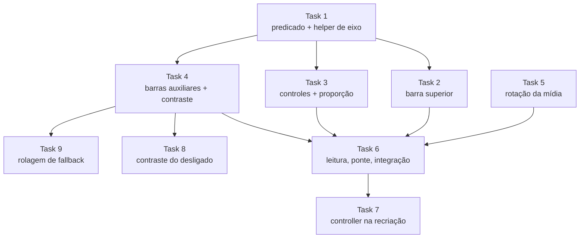

# Tarefas — Layout Adaptativo

## Visão geral

- **Total:** 9
- **Concluídas:** 9
- **Em andamento:** 0
- **Pendentes:** 0
- **Estratégia de decomposição:** fatias verticais por grupo de controle. A Task 1 é
  contrato de Wave 0 (predicado + helper de eixo), do qual quatro tarefas dependem —
  extraí-lo evita que virem uma corrente serial. A Task 5 (orientação da mídia) é
  ortogonal e pode correr desde o início.
- **Wave 3 (Tasks 7 a 9):** acrescentada em 2026-08-04, depois da verificação final.
  A Task 7 vem de defeito medido (Q-02); as Tasks 8 e 9 são as duas ressalvas da
  Task 4, resolvidas por decisão do usuário em vez de ficarem como dívida.

---

### [x] 1. Predicado de janela larga e helper de eixo

Contrato de Wave 0. Existe separado porque quatro tarefas dependem dele.

- **Size:** S
- **Complexity:** medium
- **Risk:** low
- **Dependencies:** nenhuma
- **Steps:**
  1. Criar `rememberIsWideWindow(): Boolean` lendo `LocalConfiguration`. Extrair a
     comparação para a função pura `isWideWindow(widthDp: Int, heightDp: Int): Boolean`
     para poder testar na JVM.
  2. Criar `AxisScope` expondo `Modifier.axisWeight(weight: Float)`, delegando a
     `RowScope.weight` ou `ColumnScope.weight` conforme o eixo concreto.
  3. Criar `AxisContainer(vertical: Boolean, ...)` que instancia `Row` ou `Column` e
     fornece o `AxisScope`.
  4. Converter `RowScope.TopBarSlot` em `AxisScope.TopBarSlot`, usando `axisWeight`.
- **Acceptance Criteria:**
  - **DADO** 411×891 **QUANDO** o predicado roda **ENTÃO** retorna falso
  - **DADO** 1280×800 **QUANDO** o predicado roda **ENTÃO** retorna verdadeiro
  - **DADO** 800×800 **QUANDO** o predicado roda **ENTÃO** retorna falso
  - **DADO** `AxisContainer(vertical = false)` **QUANDO** composto **ENTÃO** produz
    layout idêntico ao `Row` que substituiu
- **Verification:**
  - [x] Testes passam: `./gradlew testDebugUnitTest --tests '*WideWindow*'` (7)
  - [x] Build: `./gradlew assembleDebug`
  - [x] Manual: o app em telefone continua idêntico (nada consome o predicado ainda)
- **_Requirements: FR-1, NFR-4_**
- **_Decisions: ADR-002, ADR-003_**

---

### [x] 2. Inverter a barra superior

- **Size:** M
- **Complexity:** medium
- **Risk:** medium
- **Dependencies:** Task 1
- **Steps:**
  1. Trocar o container da barra superior por `AxisContainer(vertical = isWide)`.
  2. Trocar `align(Alignment.TopCenter)` por `CenterStart` quando `isWide`, e
     `fillMaxWidth()` por `fillMaxHeight()`.
  3. Aplicar o mesmo à linha expansível (NR, HDR, mic, grade, configurações).
  4. Trocar o inset de `safeDrawing.only(Top)` para `only(Start)` quando `isWide`.
  5. Aplicar o fundo de contraste do FR-5 ao grupo (valor definido na Task 4).
- **Acceptance Criteria:**
  - **DADO** janela larga **QUANDO** a tela compõe **ENTÃO** a barra fica no bordo
    esquerdo, empilhada verticalmente
  - **DADO** janela em retrato **QUANDO** a tela compõe **ENTÃO** a barra fica no topo,
    igual a antes
  - **DADO** recorte de câmera na lateral **QUANDO** em paisagem **ENTÃO** a barra não
    fica por baixo dele
- **Verification:**
  - [x] Testes passam: `./gradlew testDebugUnitTest` (59)
  - [x] Manual: telefone em retrato, 29 de 29 caixas de layout com bounds idênticos
        ao build anterior (NFR-1)
  - [x] Manual: tablet com a ponte removida localmente — barra à esquerda, medida em
        `uiautomator` nos x 22–119 de 2560
- **_Requirements: FR-2, FR-5, NFR-1_**
- **_Decisions: ADR-001, ADR-003_**

---

### [x] 3. Inverter os controles inferiores e a proporção da pré-visualização

- **Size:** M
- **Complexity:** medium
- **Risk:** medium
- **Dependencies:** Task 1
- **Steps:**
  1. Trocar `align(Alignment.BottomCenter)` por `CenterEnd` quando `isWide`, e o
     `Column` por `AxisContainer`.
  2. Trocar o inset de `safeDrawing.only(Bottom)` para `only(End)` quando `isWide`.
  3. Em `previewSizeModifier`, usar 16:9 quando `isWide` e manter 9:16 caso contrário.
  4. Propagar a proporção efetiva ao `setAspectRatio` do ViewModel, para que o
     `evt=bind` a registre.
- **Acceptance Criteria:**
  - **DADO** janela larga **QUANDO** a tela compõe **ENTÃO** obturador, seletor de modo
    e miniatura ficam no bordo direito
  - **DADO** janela larga em modo vídeo **QUANDO** a pré-visualização dimensiona
    **ENTÃO** usa 16:9
  - **DADO** virada de retrato para paisagem **QUANDO** o rebind ocorre **ENTÃO** o
    `evt=bind` traz `aspect` com o valor efetivo
  - **DADO** janela em retrato **QUANDO** a tela compõe **ENTÃO** tudo igual a antes
- **Verification:**
  - [x] Testes passam: `./gradlew testDebugUnitTest` (59)
  - [x] Manual: `evt=bind` traz `aspect=16:9` em tablet e `aspect=9:16` em telefone
  - [x] Manual: `elapsed_ms` de 263, 264 e 317 — teto do NFR-3 é 800
  - [x] Manual: caixa de pré-visualização medida em `[0,80]-[2560,1520]` = 1280×720dp
  - [x] **A segunda medida do NFR-3 falhava aqui e foi corrigida na Task 7.** O
        `elapsed_ms` cumpria o teto, mas "sem tela preta visível por mais de 1 segundo"
        **não**: em tablet, girar deixava a pré-visualização preta permanentemente.
        Descoberto em 2026-08-04, causa em Q-02, corrigido pela Task 7 — depois dela,
        amostras a 1,2s / 2,0s / 3,0s da virada já com imagem.
        **Esta assinatura estava errada por instrumento, não por número:** ler
        `elapsed_ms` do `evt=bind` mede configurar os use cases, não que tenha chegado
        quadro na superfície — no caminho defeituoso ele reportava sucesso em 7ms
- **_Requirements: FR-2, FR-3, FR-5, NFR-1, NFR-3_**
- **_Decisions: ADR-001, ADR-003_**

---

### [x] 4. Barras auxiliares verticais e fundo de contraste

- **Size:** M
- **Complexity:** medium
- **Risk:** low
- **Dependencies:** Task 1
- **Steps:**
  1. Converter `ZoomPresetBar` para `AxisContainer`, trocando `fillMaxWidth()` por
     `fillMaxHeight()` quando vertical.
  2. Fazer o mesmo com `HorizontalPickerBar` (resolução e fps) e renomeá-la para
     `PickerBar`, já que deixa de ser só horizontal.
  3. Definir o fundo de contraste: reaproveitar o `Color(0xFF1C1C1E)` com alfa que já
     é usado na linha expansível, aplicando-o a todo grupo sobreposto à imagem.
  4. Tratar transbordo: se a altura necessária exceder a disponível, habilitar rolagem.
- **Acceptance Criteria:**
  - **DADO** janela larga **QUANDO** a barra de zoom compõe **ENTÃO** os presets ficam
    empilhados verticalmente
  - **DADO** janela larga e baixa **QUANDO** os controles não cabem **ENTÃO** a barra
    rola ou reduz o espaçamento, sem cortar nem sobrepor
  - **DADO** câmera apontada para superfície branca **QUANDO** medido o contraste entre
    ícone e fundo composto **ENTÃO** é ≥ 4,5:1
- **Verification:**
  - [x] Testes passam: `./gradlew testDebugUnitTest` (59)
  - [x] Contraste medido: ícone ativo 15,7:1 sobre o fundo composto no pior caso de
        preview branco. **Estado "desligado" fica em 3,5:1** — ver ressalva abaixo
  - [x] Transbordo: **fallback entregue na Task 9**, que substituiu a Ressalva 2. Segue
        não exercitável por motivo estrutural — ver a Verification da Task 9
- **_Requirements: FR-4, FR-5, NFR-2_**
- **_Decisions: ADR-001, ADR-003_**

> **Ressalva 1 — resolvida pela Task 8.** O registro do problema, como foi medido em
> 2026-08-04, com o fundo composto no pior caso (scrim `0xFF1C1C1E` com alfa 0,97 sobre
> preview branco = `#232325`):
>
> | Estado do ícone | Contraste | Limiar NFR-2 |
> |---|---|---|
> | Ativo, branco cheio | **15,7:1** | passa |
> | Desligado, alfa 0,38 | **3,5:1** | não passa |
>
> O alfa 0,38 era o valor que o app já usava, e em retrato sobre a faixa preta dava
> 3,4:1 — a spec **melhorava** marginalmente o pior caso, mas não atingia 4,5:1 nesse
> estado.
>
> Decisão do usuário: subir o alfa **nos dois** layouts, para 0,48 (Task 8). Medido
> depois no pixel: 4,86:1 no tablet e 4,89:1 no telefone.
>
> **Duas afirmações desta ressalva estavam erradas.** "Subir o alfa mudaria a aparência
> também em retrato, o que o NFR-1 proíbe": o NFR-1 mede âncoras e posicionamento, não
> cor, e as 233 caixas seguem idênticas porque alfa não move bounds. Mudar o retrato é
> visível, sim — mas é decisão de produto, não violação de requisito.
>
> **Ressalva 3 — FR-5 não é atendido em retrato, por escolha.** O texto do requisito
> condiciona o fundo de contraste a "estar sobreposto à pré-visualização", não a a
> janela ser larga. Em retrato o grupo inferior **também** fica sobre a imagem — ele é
> filho da caixa de pré-visualização, ancorado no rodapé dela. O fundo foi aplicado só
> em janela larga porque aplicá-lo em retrato seria mudança visível, e o NFR-1 é
> Critical. Os botões de lá têm círculo escuro próprio; o texto `Vídeo`/`Foto` não tem,
> e sobre cena clara ele desaparece — em retrato isso já acontecia antes desta spec.
>
> **Ressalva 4 — resolvida em 2026-08-04.** AC-9.3 foi exercitado em Tablet_API36 com o
> nível ligado, em três estados de sensor. O caso que discrimina é o terceiro:
>
> | Estado | `rollDegrees` | janela | ângulo desenhado | cor |
> |---|---|---|---|---|
> | natural | 0° | ROTATION_0 | horizontal | verde |
> | girado 90° | +90° | ROTATION_90 | horizontal | verde |
> | girado 90° + 10° | +100° | ROTATION_90 | **8,68° medidos** | branco |
>
> O terceiro estado separa as hipóteses: a linha usa a inclinação **residual** dentro da
> janela, não os 100° crus nem os 90° da janela. Os 8,68° contra 10° teóricos são o
> filtro passa-baixa de `rollDegrees` (0.7/0.3) ainda convergindo — a medição não
> distingue 8,68° de 10°, mas distingue com folga de 90° e de 100°, que é o que o AC
> pede. Cor média 129,129,129 = branco a alfa 0,55, ou seja "não nivelado" decidido pela
> inclinação **física** (|100| − 90 = 10 > 2), como o AC-9.3 exige.
>
> **Ressalva 2 — resolvida pela Task 9, na parte que era resolvível.** Tentativa com
> `wm size 2560x760` falhou como teste: a 380dp de altura o `smallestWidth` cai abaixo
> de 600dp, o Android volta a honrar `screenOrientation` e a janela sai pillarboxed em
> retrato — o layout largo nem ativa. Nesse aparelho, janela larga implica
> `sw >= 600dp`, logo pelo menos 600dp de altura para cinco slots de ~46dp, e o
> transbordo é inalcançável.
>
> O que a ressalva apontava como risco real era outra coisa: **não havia rolagem de
> fallback**, então numa janela livre curta o suficiente os controles se sobreporiam.
> Decisão do usuário: implementar a rolagem (Task 9). O AC-4.3 continua sem cobertura
> por não ser alcançável neste hardware, mas o modo de falha que a ressalva descrevia
> deixou de existir — e sem precisar do container que mede, que era o custo temido.

---

### [x] 5. Separar rotação de captura e compensação da UI

Independente das tarefas de layout. **Redefinida em 2026-08-04** pela Q-01: a medição
em aparelho mostrou que compor as duas rotações na captura dobraria a rotação. A
grandeza que precisa da rotação da janela é a compensação da UI.

- **Size:** S
- **Complexity:** high
- **Risk:** high
- **Dependencies:** nenhuma
- **Steps:**
  1. Extrair `captureRotation(rollDegrees: Float): Int` — pura, só o sensor,
     comportamento idêntico ao anterior; o ganho é testabilidade na JVM.
  2. Criar `uiRotation(rollDegrees, displayRotation): Float` — quanto girar ícones
     descontando o que o compositor já girou; e `windowRelativeRoll(...)` contínua,
     para o ângulo do nível de horizonte.
  3. Ligar na `CameraScreen`: `displayRotation` precisa ser **estado** atualizado no
     listener do acelerômetro, não leitura direta — `view.display` é nulo até a View
     ser anexada, e leitura simples nunca é reavaliada.
  4. Cobrir as 16 combinações (4 rotações físicas × 4 de janela) em teste de tabela.
- **Acceptance Criteria:**
  - **DADO** janela que acompanha o aparelho **QUANDO** a UI compõe **ENTÃO** os
    ícones não recebem rotação adicional
  - **DADO** telefone travado em retrato girado 90° na mão **QUANDO** grava **ENTÃO** o
    arquivo sai em paisagem e os ícones giram — comportamento atual preservado
  - **DADO** qualquer combinação **QUANDO** a mídia é salva **ENTÃO** a orientação é
    conferida no arquivo (metadado do MP4 ou EXIF do JPEG), não na pré-visualização
- **Verification:**
  - [x] Testes passam: `./gradlew testDebugUnitTest --tests '*DeviceRotation*'` (12)
  - [x] Manual: MP4 e JPEG puxados do tablet e inspecionados com `ffprobe` — cena de
        pé nas duas pontas
  - [x] Manual: captura de tela do tablet com janela livre — ícones de pé
  - [x] Manual: captura de tela do telefone travado girado na mão — ícones giram,
        `mCurrentRotation` permanece ROTATION_0 (NFR-1)
- **_Requirements: FR-6, FR-9, NFR-1, NFR-4_**
- **_Decisions: Q-01_**

> `Size: S` com `Complexity: high` e `Risk: high` se confirmou: são poucas linhas, mas
> a primeira ligação parecia certa e não funcionava — `view.display` nulo na primeira
> composição congelava a compensação em zero. Só a verificação em aparelho pegou.

---

### [x] 6. Largura de leitura, remoção da ponte e verificação integrada

Fecha a spec. Depende de tudo porque só faz sentido remover a ponte com o adaptativo
funcionando.

- **Size:** M
- **Complexity:** low
- **Risk:** medium
- **Dependencies:** Task 2, Task 3, Task 4, Task 5
- **Steps:**
  1. Limitar a largura do conteúdo de `SettingsScreen` e `AboutScreen` quando a janela
     for larga, centralizando (`widthIn(max = 640.dp)`).
  2. Remover `PROPERTY_COMPAT_ALLOW_RESTRICTED_RESIZABILITY` do manifesto.
  3. Conferir `wc -l CameraScreen.kt` contra o teto do NFR-5.
  4. Rodar a verificação completa nos dois emuladores.
  5. Atualizar `CLAUDE.md` e `REFACTORING.md`: o item sobre orientação sai da lista de
     pendências.
- **Acceptance Criteria:**
  - **DADO** o manifesto após a remoção **QUANDO** inspecionado com `dumpsys` **ENTÃO**
    a activity ocupa a janela inteira do tablet, sem pillarbox
  - **DADO** o tablet sem a ponte **QUANDO** o app abre **ENTÃO** o layout está
    adaptado, não esticado
  - **DADO** Configurações em janela larga **QUANDO** a lista é exibida **ENTÃO** o
    conteúdo tem largura limitada e centralizada
  - **DADO** `CameraScreen.kt` **QUANDO** contado **ENTÃO** tem ≤ 2.240 linhas
- **Verification:**
  - [x] Verificação completa: `./gradlew assembleDebug testDebugUnitTest lint detekt`
        verde, 64 testes
  - [x] Manual: Tablet_API36 sem a ponte — `mBounds=Rect(0, 0 - 2560, 1600)`, sem
        pillarbox, `aspect=16:9`, bind em 62ms
  - [x] Manual: ausência da ponte conferida também no manifesto **compilado** do APK
        (`aapt2 dump xmltree`), não só no fonte
  - [x] Manual: Configurações em janela larga com conteúdo em 640dp centralizado, e o
        título do app bar alinhado à lista
  - [x] `wc -l CameraScreen.kt` = **2.141**, teto do NFR-5 = 2.240
  - [x] Manual: telefone reconferido em 2026-08-04 **contra o APK pré-spec**
        (`b3494b0`, construído em worktree separado para não repetir a armadilha do
        `git stash`). Pixel_9_Pro API 36, 427×952dp. Cinco estados comparados por
        `uiautomator`, com os bounds normalizados e diferenciados:

        | Estado | Caixas | Resultado |
        |---|---|---|
        | Câmera | 29 | idênticas |
        | Câmera, barra expandida | 43 | idênticas |
        | Configurações, topo | 55 | idênticas |
        | Configurações, rolada ao fim | 57 | idênticas |
        | Sobre | 49 | idênticas, exceto o rótulo do `GIT_SHA` |

        **233 caixas, nenhuma diferença de posicionamento.** A única divergência é o
        texto `b3494b0` → `d5ddcf6` na tela Sobre, 11px de largura de glifo — que é
        justamente a prova de que os dois APKs eram os pretendidos. NFR-1 assinado.
  - [x] Manual: **repetido depois das Tasks 7 a 9** (2026-08-04), mesmos cinco estados
        contra o mesmo baseline `b3494b0` — 233 caixas, novamente só o `GIT_SHA`
        divergindo. Confirma que a mudança de alfa da Task 8 não move bounds e que a
        rolagem da Task 9 não entra em retrato
- **_Requirements: FR-7, FR-8, NFR-1, NFR-5_**
- **_Decisions: ADR-001_**

---

### [x] 7. Reconstruir o controller quando a Activity é recriada

Vem de defeito **medido**, não de requisito novo: girar o tablet deixava a
pré-visualização preta para sempre, reprovando a segunda medida do NFR-3. Ver Q-02.

- **Size:** S
- **Complexity:** medium
- **Risk:** medium
- **Dependencies:** Task 6 (só aparece com a ponte removida)
- **Steps:**
  1. `CameraViewModel` guarda em `WeakReference` qual `LifecycleOwner` criou o
     controller atual.
  2. `initializeCamera` passa a decidir: mesmo owner → religa a surface e reaplica os
     ajustes; owner diferente → libera o antigo e reconstrói.
  3. Os 16 coletores dos fluxos do controller viram filhos de um job único, para serem
     cancelados junto com o controller que observam.
  4. A carga do storage fica restrita à primeira criação — recarregar a cada virada
     faria o ramo de "manter configurações desligado" resetar os padrões.
  5. `CameraScreen`: `lifecycleOwner` entra como chave do `LaunchedEffect`, e a decisão
     sai da tela para o ViewModel, onde é testável na JVM.
- **Acceptance Criteria:**
  - **DADO** tablet em janela larga **QUANDO** o aparelho é girado **ENTÃO** a
    pré-visualização volta a exibir imagem, sem tela preta por mais de 1 segundo
  - **DADO** a volta da tela de Configurações **QUANDO** o `PreviewView` é recriado
    **ENTÃO** o controller é reaproveitado, sem ciclo de fechar/abrir a câmera
  - **DADO** `LifecycleOwner` diferente **QUANDO** `initializeCamera` roda **ENTÃO** o
    controller antigo é liberado e um novo é criado com o owner novo
- **Verification:**
  - [x] Testes: 2 novos em `CameraViewModelTest`, RED antes (`AssertionError` nas duas
        asserções que discriminam), verde depois — 66 no total
  - [x] Build: `./gradlew assembleDebug testDebugUnitTest detekt lint` verde
  - [x] APK conferido no dex (`boundLifecycleOwner`, `controllerCollectors`) antes de
        instalar
  - [x] Manual: Tablet_API36, quatro orientações — luminância 188,5 / 179,2 / 187,4 /
        188,0, todas com imagem (antes: 188,5 e depois **0,1** permanente)
  - [x] Manual: a câmera de fato **reabre** — `Camera 1: Opened` 707ms e 624ms após
        cada `disconnect`, o que não acontecia
  - [x] Manual: amostras a 1,2s / 2,0s / 3,0s da virada já com imagem (NFR-3, segunda
        medida)
  - [x] Manual: `aspect` alterna 16:9 → 9:16 → 16:9, com `elapsed_ms` de 11 a 130
- **_Requirements: NFR-3, NFR-4_**
- **_Decisions: Q-02_**

> A correção também fecha um vazamento que existia por acidente: o ViewModel retinha a
> Activity destruída através do controller. Agora a referência é fraca e o controller é
> liberado.

---

### [x] 8. Contraste do estado desligado

Ressalva 1 da Task 4, resolvida por decisão do usuário: subir o alfa **nos dois
layouts**, em vez de aceitar 3,5:1 como dívida.

- **Size:** S
- **Complexity:** low
- **Risk:** low
- **Dependencies:** Task 4
- **Steps:**
  1. Extrair as seis ocorrências literais de `alpha = 0.38f` para
     `OFF_CONTROL_ALPHA`, com a tabela de contraste no KDoc.
  2. Subir o valor para **0,48**, calculado pela luminância relativa da WCAG 2.1.
  3. Deixar o alfa 0,2 dos controles **não suportados** como está.
- **Acceptance Criteria:**
  - **DADO** controle desligado sobre o fundo composto **QUANDO** medido **ENTÃO** o
    contraste é ≥ 4,5:1
  - **DADO** o estado "não suportado" **QUANDO** exibido **ENTÃO** continua
    visivelmente mais fraco que "desligado"
- **Verification:**
  - [x] Cálculo validado: o modelo reproduz os números da medição anterior (3,51 e
        3,39 contra os 3,5 e 3,4 registrados na Ressalva 1), então o 4,73/4,89 previsto
        para 0,48 vem do mesmo modelo já conferido
  - [x] Manual: medido **no pixel** da captura do tablet — alfa efetivo **0,478**
        contra 0,480 pretendido, contraste do desligado **4,86:1**, do ativo 17,20:1
  - [x] `./gradlew assembleDebug testDebugUnitTest detekt lint` verde
- **_Requirements: FR-5, NFR-2_**

> **Correção de leitura da Ressalva 1.** Ela afirmava que subir o alfa "o NFR-1
> proíbe". O NFR-1 mede **âncoras e posicionamento** ("sem diferença perceptível nas
> âncoras"), não cor — e a comparação de 223 caixas segue valendo, porque alfa não muda
> bounds. Subir o alfa em retrato é mudança deliberada exigida pelo NFR-2, não
> regressão. O que a Ressalva 1 descrevia corretamente é que **seria visível**; a
> decisão de produto foi aceitar isso.
>
> **Limite do que esta tarefa entrega.** O alfa só ajuda onde o fundo é escuro. A
> Ressalva 3 continua aberta e é outro assunto: em retrato o texto `Vídeo`/`Foto` não
> tem fundo de contraste próprio, e sobre cena clara ele desaparece — subir o alfa do
> branco ali **piora**, não melhora. Fechar aquilo exige scrim em retrato, que não foi
> o que se decidiu.

---

### [x] 9. Rolagem de fallback nas barras verticais

Ressalva 2 da Task 4, resolvida por decisão do usuário: rolagem simples, em vez de
aceitar o transbordo como inalcançável.

- **Size:** S
- **Complexity:** low
- **Risk:** low
- **Dependencies:** Task 4
- **Steps:**
  1. `AxisContainer` ganha `scrollable: Boolean = false`, que aplica `verticalScroll`
     só no eixo vertical. Opt-in, não default: ligado em toda parte valeria também
     para o retrato.
  2. Ligar `scrollable = isWide` nas colunas do bordo esquerdo (as duas barras de
     ícones e a linha expansível).
  3. Aplicar `verticalScroll` ao grupo do bordo direito, que é um `Column` direto e é o
     mais alto — zoom, seletor de modo, obturador e miniatura com 16dp entre eles.
  4. Uma rolagem por grupo ancorado: aninhar duas no mesmo eixo torna o arraste
     ambíguo, e o disco de zoom já usa arraste.
- **Acceptance Criteria:**
  - **DADO** janela larga e baixa **QUANDO** os controles não cabem **ENTÃO** a barra
    rola, sem cortar nem sobrepor
  - **DADO** janela em retrato **QUANDO** a tela compõe **ENTÃO** nenhuma rolagem é
    adicionada
- **Verification:**
  - [x] `./gradlew assembleDebug testDebugUnitTest detekt lint` verde, 66 testes
  - [x] `wc -l CameraScreen.kt` = **2.181**, teto do NFR-5 = 2.240
  - [ ] **Não exercitado, e por motivo estrutural — reconfirmado em 2026-08-04.**
        `wm size 2560x700` no tablet devolve `sw263dp w263dp h350dp` e
        `mBounds=Rect(1018, 0 - 1543, 700)`: com `smallestWidth` abaixo de 600dp o
        Android volta a honrar `screenOrientation="portrait"`, a janela sai pillarboxed
        em retrato e o layout largo **nem ativa**. Para a janela ser larga é preciso
        `sw ≥ 600dp`, logo ≥ 600dp de altura, e nessa altura os grupos cabem.
        O que muda em relação à Ressalva 2 é que **agora existe fallback** — antes,
        numa janela livre curta os controles se sobreporiam; agora rolam
- **_Requirements: FR-4_**
- **_Decisions: ADR-003_**

---

## Dependências

---

## Esquema de paralelização

| Onda | Tarefas | Em paralelo | Observação |
|---|---|---|---|
| **Wave 0** | Task 1, Task 5 | Sim | Task 1 é contrato; Task 5 é ortogonal (mídia, não layout) |
| **Wave 1** | Task 2, Task 3, Task 4 | Sim | Dependem só do contrato da Task 1 e tocam grupos distintos |
| **Wave 2** | Task 6 | — | Integração e remoção da ponte |
| **Wave 3** | Task 7, Task 8, Task 9 | Sim | Task 7 só é visível com a ponte fora; 8 e 9 são as ressalvas da Task 4 e tocam pontos distintos |

**Caminho crítico:** Task 1 → Task 3 → Task 6. A Task 3 é a mais pesada da Wave 1
(inverte controles **e** troca a proporção, com o rebind do CameraX no meio).

**Makespan:** 3 ondas contra 6 passos sequenciais. Custo em paralelo:
`max(T1, T5) + max(T2, T3, T4) + T6`.

### Checkpoints de onda (obrigatórios)

- **Após Wave 0:** `./gradlew testDebugUnitTest` verde, com os testes novos do
  predicado e da rotação. O app ainda se comporta exatamente como hoje — nada consome
  o predicado. É o que confirma que o contrato não quebrou nada.
- **Após Wave 1:** `scripts/smoke.sh` nos dois emuladores. Em telefone, captura
  comparada com a de hoje (NFR-1). Em tablet, a ponte ainda está no manifesto, então
  verificar paisagem exige removê-la **temporariamente** — não comitar essa remoção
  aqui; ela é da Task 6.
- **Após Wave 2:** verificação completa nos dois aparelhos, com a ponte removida de vez.

---

## Rastreabilidade

| Requisito | Tarefas |
|---|---|
| FR-1 | Task 1 |
| FR-2 | Task 2, Task 3 |
| FR-3 | Task 3 |
| FR-4 | Task 4, Task 9 |
| FR-5 | Task 2, Task 3, Task 4, Task 8 |
| FR-6 | Task 5 |
| FR-7 | Task 6 |
| FR-8 | Task 6 |
| FR-9 | Task 5 |
| NFR-1 | Task 2, Task 3, Task 6 |
| NFR-2 | Task 4, Task 8 |
| NFR-3 | Task 3, Task 7 |
| NFR-4 | Task 1, Task 5, Task 7 |
| NFR-5 | Task 6, Task 9 |

| ADR | Tarefas |
|---|---|
| ADR-001 | Task 2, Task 3, Task 4, Task 6 |
| ADR-002 | Task 1 |
| ADR-003 | Task 1, Task 2, Task 3, Task 4, Task 9 |
| Q-01 | Task 5 |
| Q-02 | Task 7 |
