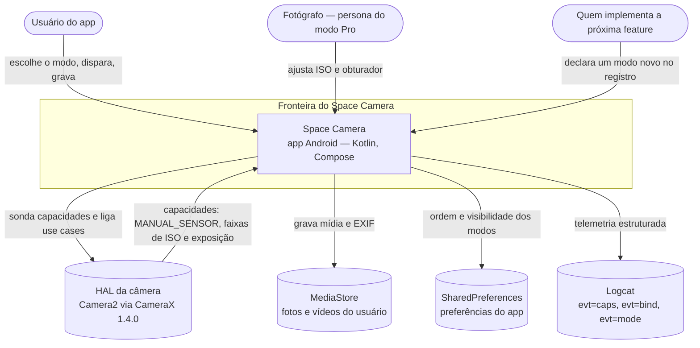
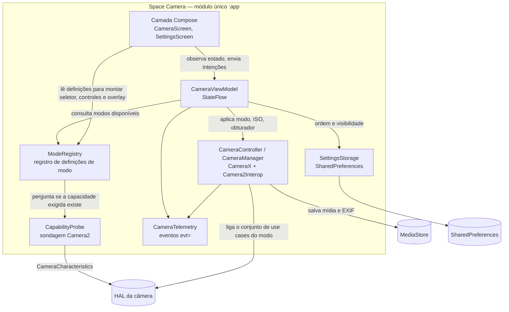
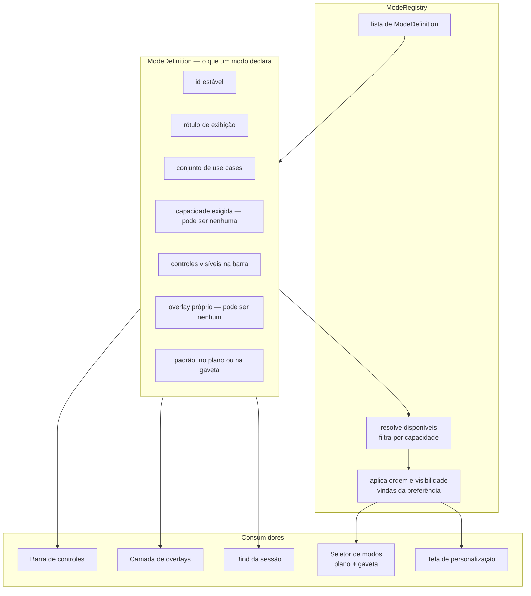
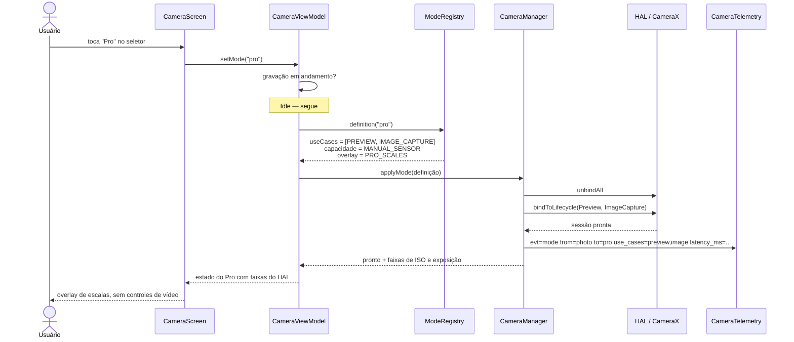
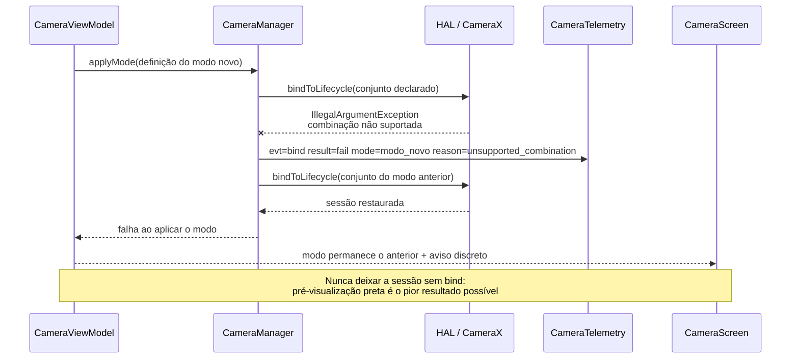
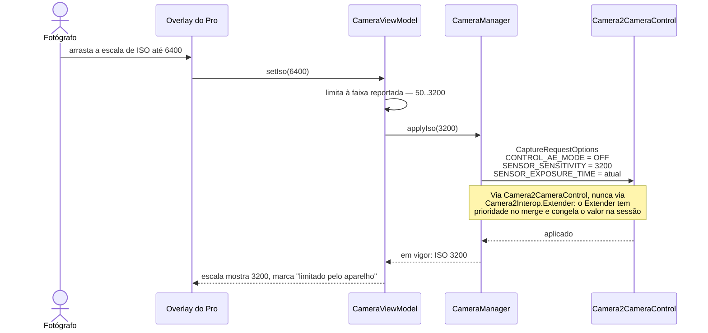
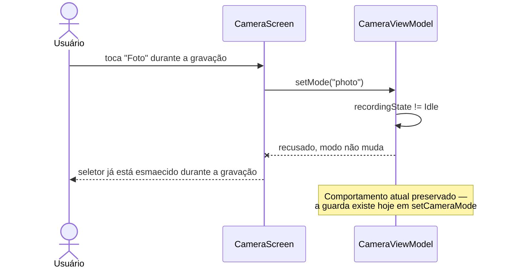
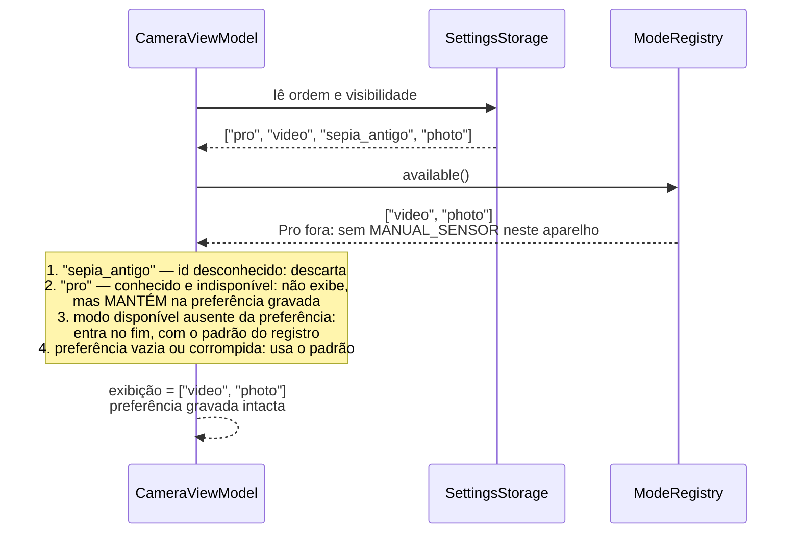

# Design — Registro de Modos Extensível

## 1. Contexto (C4 nível 1)



**Fronteiras.** A spec não cria integração externa nova. O que muda é *de onde* a UI e o
controller tiram a resposta para "o que este modo faz" — hoje de ramificações espalhadas,
depois de um registro. As duas integrações que ganham conteúdo novo são o HAL (capacidade
`MANUAL_SENSOR` e faixas) e o `SharedPreferences` (ordem e visibilidade dos modos).

**Ator não humano que importa:** o HAL decide se o modo Pro existe. Em aparelho sem
`MANUAL_SENSOR` o modo não aparece — e o emulador está nesse grupo, o que faz comportamento
correto e defeituoso coincidirem (armadilha 4 do CLAUDE.md).

---

## 2. Contêineres (C4 nível 2)



**O que é novo:** `ModeRegistry` e `CapabilityProbe`. **O que muda de responsabilidade:** o
`CameraManager` deixa de decidir o conjunto de use cases e passa a executar o conjunto que a
definição do modo declara. **O que não muda:** `SettingsStorage`, `MediaStore`,
`CameraTelemetry` e o desenho geral `UI → ViewModel → Controller`.

---

## 3. Componentes (C4 nível 3) — o registro



### Forma do contrato

Hierarquia selada com membros abstratos (ADR-001, forma híbrida aprovada). Especificação da
forma, não implementação — sem corpos, para o dev skill preencher:

```
sealed class CameraModeDefinition {
    // ── dados: escolha de conjunto fechado ───────────────────────
    abstract val id: CameraModeId
    abstract val label: String
    abstract val useCases: Set<AppUseCase>
    abstract val requiredCapability: Capability?
    abstract val controls: List<ControlId>
    abstract val overlay: OverlayId?
    abstract val pinnedByDefault: Boolean

    // ── comportamento: varia por modo, devolve descrição ─────────
    abstract fun shutterAction(state: CaptureState): ShutterAction
    abstract fun flashBehavior(): FlashBehavior
}
```

| Elemento | Forma | Observação |
|---|---|---|
| `CameraModeId` | identificador estável e serializável (`"video"`, `"photo"`, `"pro"`) | **não** `ordinal` — FR-8 / premissa P3 |
| `label` | texto de exibição | vem de `strings.xml`; o A6 do ROADMAP.md pode extrair depois sem tocar aqui |
| `useCases` | conjunto declarado: `PREVIEW`, `VIDEO_CAPTURE`, `IMAGE_CAPTURE` | tipo próprio do app, **não** tipo do CameraX — é o que permite trocar para `SessionConfig` na 1.6 sem mexer nas declarações (ADR-002) |
| `requiredCapability` | capacidade ou nenhuma | Pro exige `MANUAL_SENSOR`; Vídeo e Foto não exigem nada |
| `controls` | lista ordenada de identificadores de controle | quem desenha é a UI; a definição diz *quais* e em que ordem |
| `overlay` | identificador de overlay ou nenhum | a UI mapeia identificador → composable, mantendo composable fora do domínio |
| `pinnedByDefault` | booleano | Vídeo e Foto verdadeiros e não removíveis (P2) |
| `shutterAction(state)` | devolve `ShutterAction` — `StartRecording`, `StopRecording`, `PauseRecording`, `CapturePhoto`, … | o modo diz **o que** a ação é; o ViewModel executa. É o que faz o disparador do Vídeo gravar e o do Pro capturar sem `when` no ViewModel |
| `flashBehavior()` | devolve `FlashBehavior` — `Torch`, `PhotoCycle`, `Unavailable` | resolve o caso real do flash: tocha em Vídeo, ciclo OFF→AUTO→ON em Foto |
| `ModeRegistry.available()` | lista filtrada por capacidade | FR-5 |
| `ModeRegistry.arranged(pref)` | lista ordenada e particionada em plano/gaveta | FR-6, FR-8 |

**Guarda-corpos da definição de modo** — cada um vira critério de aceite de tarefa, porque
violá-los desfaz a razão do desenho:

| Proibido dentro de `CameraModeDefinition` | Por quê |
|---|---|
| estado mutável | o modo viraria um segundo ViewModel, e o teste de unidade deixaria de ser determinístico |
| chamada ao `CameraController` | inverteria a direção da dependência e traria CameraX para dentro do registro |
| `@Composable` | poria UI no domínio e tiraria o registro do alcance do teste JVM puro (NFR-5) — foi exatamente a linha que reprovou a alternativa C na matriz |
| executar a ação em vez de descrevê-la | `shutterAction` devolve o que fazer; quem faz é o ViewModel |

**Por que identificador de overlay e de controle, e não o composable direto:** a UI resolve
identificador → composable numa tabela própria — justamente o arquivo que um modo novo
acrescenta. O custo dessa indireção é um erro que sai do compilador e vira erro de execução;
o contrapeso obrigatório é um teste JVM que varre o registro e falha se algum identificador
declarado não tiver correspondente na tabela (AC da Tarefa 2).

---

## 4. Fluxos (sequências)

### 4.1 Sucesso — troca para o modo Pro



### 4.2 Falha — combinação de use cases recusada pelo aparelho



### 4.3 Aplicar ISO manual



### 4.4 Falha — troca de modo durante gravação



### 4.5 Leitura da preferência de modos

Não há migração de banco — §8.8 do skill não se aplica. Mas a leitura tem quatro casos de
compatibilidade que o NFR-8 exige tratar, e eles são o ponto mais fácil de errar:



O caso 2 é o que o consenso do Gate 1 pegou: apagar o `"pro"` da preferência por não estar
disponível *neste* aparelho faz o usuário perder a configuração ao trocar de aparelho ou ao
atualizar. A preferência é do usuário, não do hardware.

---

## 5. Implantação (C4 nível 4)

**Dispensada, com justificativa.** APK único instalado em aparelho, sem ambiente de servidor,
sem múltiplos ambientes e sem topologia a descrever. O §8.6 do skill trata o diagrama como
obrigatório para sistemas em produção multiambiente e opcional fora disso. O que existe de
"implantação" aqui está em [BUILD.md](../../BUILD.md) e em `scripts/backup-apk.sh`, incluindo a
conferência de `GIT_SHA` do APK — que é o controle que substitui, na prática, um diagrama de
topologia: garante que o que foi verificado é o que foi empacotado.

---

## 6. Onde cada requisito aterra

| Requisito | Componente |
|---|---|
| FR-1, FR-2 | `ModeRegistry` + `ModeDefinition`, consumidos pelo bind |
| FR-3, FR-4 | definições de Vídeo e Foto reproduzindo o comportamento atual |
| FR-5, AC-5.3 | `CapabilityProbe` + `ModeRegistry.available()` |
| FR-6, FR-14, FR-17 | seletor de modos com plano, gaveta e eixo sem quantidade fixa |
| FR-7, FR-8, FR-16, NFR-8 | tela de personalização + `SettingsStorage` |
| FR-9 a FR-12 | definição do Pro + `Camera2CameraControl` + caminho de foto existente |
| FR-13, NFR-7 | `CameraTelemetry` |
| FR-15 | guarda em `setMode`, preservada |
| NFR-1 a NFR-6 | verificação: testes JVM, `wc -l`, `evt=`, detekt e lint |
