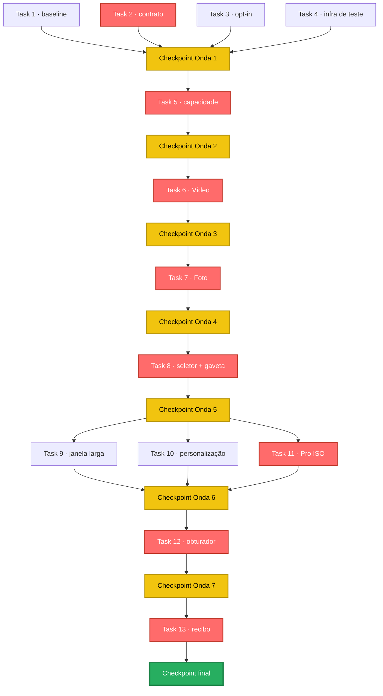

# Tarefas — Registro de Modos Extensível

## Visão geral

- **Total de tarefas:** 13
- **Concluídas:** 2 · **Em andamento:** 0 · **Pendentes:** 11
- **Estratégia de decomposição:** fatia vertical **por modo**, não por camada. Cada fatia
  atravessa registro → controller → ViewModel → UI → teste e é verificável sozinha em
  aparelho. Vídeo e Foto entram como fatias de **remigração iso-comportamento** (a rede de
  segurança), e o Pro entra depois, dividido por controle (ISO, depois obturador), para que
  nenhuma tarefa passe de `L`.
- **Nenhuma tarefa `XL`** — o ritual do §9.0.4 não foi necessário.
- **Ondas derivadas das dependências**, não do agrupamento por propósito: cadeias seriais
  (6 → 7 → 8) não podem compartilhar onda, porque onda é o conjunto que roda em paralelo.
  Um único cluster conectado — não há frentes totalmente independentes nesta spec.

---

## Ondas

> Ondas rodam em sequência; tarefas dentro de uma onda rodam em paralelo. O **Checkpoint de
> Onda** separa cada uma e precisa passar antes da próxima começar. IDs são planos (1…13) para
> manter a rastreabilidade estável.

### Onda 1 — Medição e contratos (nenhuma mudança de comportamento)

#### [x] 1. Baseline de comportamento e de latência (antes de tocar em qualquer código)
- **Size:** XS
- **Complexity:** low
- **Risk:** low
- **Dependencies:** (nenhuma)
- **Steps:**
  1. Conferir que o APK instalado é o do commit atual: `scripts/backup-apk.sh` (ele compara o `GIT_SHA` do commit com o de dentro do APK).
  2. Capturar `scripts/logcat.sh 'evt=caps'` e `scripts/logcat.sh 'evt=bind'` em **aparelho real** para os modos Vídeo e Foto, e salvar a saída em `specs/2026-08-05-mode-registry/baseline/`.
  3. Alternar Vídeo↔Foto 10 vezes e anotar o p95 de `latency_ms` de `evt=bind`.
  4. Anotar `wc -l` de `CameraScreen.kt`, `CameraManager.kt` e `CameraViewModel.kt`.
  5. Registrar tudo em `agent-progress.md` — é o número contra o qual NFR-1, NFR-3 e NFR-4 serão medidos.
- **Acceptance Criteria:**
  - **DADO** o commit atual **QUANDO** o baseline é capturado **ENTÃO** existe registro de `evt=caps`, `evt=bind`, p95 de latência e contagem de linhas dos três arquivos
  - **DADO** o baseline **QUANDO** for comparado no fim **ENTÃO** foi tirado em aparelho real, não em emulador (o emulador reporta EIS/HDR como não suportados e invalida a comparação)
- **Verification:**
  - [x] Baseline existe: `ls specs/2026-08-05-mode-registry/baseline/`
  - [x] APK conferido: `GIT_SHA 3b3043e` presente no dex, sem divergência
  - [x] Conferência manual: a tela medida era a câmera — `content-desc` `Flash`/`Trocar câmera`/`Timer desativado`, 32 nós
- **_Requirements: NFR-1, NFR-3, NFR-4_**

#### [x] 2. Contrato do registro de modos
- **Size:** M
- **Complexity:** medium
- **Risk:** low
- **Dependencies:** (nenhuma)
- **Steps:**
  1. Criar os tipos do contrato: `CameraModeId` (identificador estável em texto), `AppUseCase` (`PREVIEW`, `VIDEO_CAPTURE`, `IMAGE_CAPTURE`), `Capability`, `ControlId`, `OverlayId`, `ShutterAction`, `FlashBehavior`, `ModeArrangement` (ordem + visibilidade, com padrão).
  2. Criar `sealed class CameraModeDefinition` com os membros abstratos da tabela de [design.md §3](design.md#forma-do-contrato).
  3. Declarar `VideoMode` e `PhotoMode` reproduzindo em **declaração** o que hoje está em ramificação — ainda **sem** consumidores: nada na UI nem no controller muda nesta tarefa.
  4. Criar `ModeRegistry` com `available()` (filtra por capacidade) e `arranged(pref)` (ordem + plano/gaveta).
  5. Criar a tabela de resolução `OverlayId`/`ControlId` → composable, ainda vazia de overlays (Vídeo e Foto não têm overlay próprio).
  6. Testes **JVM puros**: ids únicos, `pinnedByDefault` verdadeiro para Vídeo e Foto, `available()` filtrando por capacidade, e o **teste de completude** — todo `OverlayId`/`ControlId` declarado no registro resolve na tabela.
- **Acceptance Criteria:**
  - **DADO** o registro **QUANDO** `available()` é chamado com uma capacidade ausente **ENTÃO** o modo que a exige não aparece na lista
  - **DADO** um modo que declara um `OverlayId` sem correspondente na tabela **QUANDO** o teste de completude roda **ENTÃO** ele falha (hoje passa vazio, e passa a valer de fato na Tarefa 11 — é a rede que compensa a indireção do ADR-001)
  - **DADO** os testes desta tarefa **QUANDO** rodam **ENTÃO** não carregam Compose nem CameraX
  - **DADO** `CameraModeDefinition` **QUANDO** revisada **ENTÃO** não tem estado mutável, não chama o controller e não expõe `@Composable` (guarda-corpos do design §3)
- **Verification:**
  - [x] Testes passam: `./gradlew testDebugUnitTest --tests '*ModeRegistry*' --tests '*ModeDefinition*'` — 24 testes, JVM pura
  - [x] Build: `./gradlew assembleDebug detekt lint`
  - [x] Conferência manual: nenhuma — esta tarefa não muda o app em execução, e é isso que a torna segura
  - [x] Asserções conferidas por mutação: quebrar o gate de capacidade e inverter a ordem do disparador do Vídeo fazem os testes falharem
- **_Requirements: FR-1, FR-5, NFR-5_**
- **_Decisions: ADR-001, ADR-002, ADR-006_**

#### [ ] 3. Corrigir o consentimento de opt-in do Camera2Interop
- **Size:** XS
- **Complexity:** low
- **Risk:** low
- **Dependencies:** (nenhuma)
- **Steps:**
  1. Trocar `@OptIn(ExperimentalCamera2Interop::class)` por `@androidx.annotation.OptIn(markerClass = ExperimentalCamera2Interop::class)` em `CameraManager.kt`.
  2. Se o símbolo não resolver, acrescentar `androidx.annotation:annotation-experimental` ao catálogo e ao `build.gradle.kts` — versão **só** em `libs.versions.toml`.
  3. Conferir que o aviso do compilador *"is not an opt-in requirement marker"* desapareceu.
  4. Reencolher o baseline de lint: `./gradlew updateLintBaseline`.
- **Acceptance Criteria:**
  - **DADO** o build **QUANDO** compila **ENTÃO** o aviso de marcador de opt-in inválido não aparece
  - **DADO** `./gradlew lint` **QUANDO** roda **ENTÃO** `UnsafeOptInUsageError` em `CameraManager` caiu de 31 para 0, e o baseline encolheu em vez de crescer
- **Verification:**
  - [ ] Build: `./gradlew assembleDebug 2>&1 | grep -c "opt-in requirement marker"` → 0
  - [ ] Lint: `./gradlew lint` e conferir a contagem em `app/lint-baseline.xml`
  - [ ] Conferência manual: nenhuma
- **_Requirements: NFR-6_**
- **_Decisions: ADR-005_**

#### [ ] 4. Infraestrutura de teste de Compose na JVM
- **Size:** S
- **Complexity:** medium
- **Risk:** medium
- **Dependencies:** (nenhuma)
- **Steps:**
  1. Acrescentar `testImplementation(libs.compose.ui.test.junit4)` — hoje a dependência existe só em `androidTestImplementation`.
  2. Escrever **um** teste de fumaça do seletor atual (ainda baseado em `CameraMode.entries`) com `createComposeRule()` + `@RunWith(RobolectricTestRunner::class)` + `@Config(sdk = [34])`, seguindo o padrão dos testes Robolectric que já existem.
  3. Asserções **apenas de árvore semântica** — nó existe, rótulo, clique. Nada de `captureToImage`.
  4. Medir o tempo da suíte completa e anotar.
- **Acceptance Criteria:**
  - **DADO** `./gradlew testDebugUnitTest` **QUANDO** roda sem aparelho conectado **ENTÃO** o teste de Compose passa
  - **DADO** a suíte completa **QUANDO** roda **ENTÃO** termina em ≤ 90 s
  - **DADO** o teste **QUANDO** escrito **ENTÃO** não usa `captureToImage` (evita o estouro de tempo com gráficos nativos)
- **Verification:**
  - [ ] Testes passam: `./gradlew testDebugUnitTest`
  - [ ] Tempo: `./gradlew testDebugUnitTest --profile` e conferir o relatório
  - [ ] Conferência manual: nenhuma
- **_Requirements: NFR-5_**
- **_Decisions: ADR-006_**

### Checkpoint da Onda 1
- [ ] Critérios de aceite das Tarefas 1–4 atendidos
- [ ] Verificação de cada tarefa passou (testes + build + conferência)
- [ ] Baseline capturado em **aparelho real** e registrado em `agent-progress.md`
- [ ] Registro instanciável e testado em JVM pura, ainda sem consumidores
- [ ] Teste de completude do registro existe e roda
- [ ] Opt-in corrigido e baseline de lint **encolhido**, não regenerado
- [ ] Suíte completa em ≤ 90 s
- [ ] **O app em execução está idêntico ao do início da onda** — nenhuma mudança de comportamento
- [ ] Nenhum bloqueio aberto em `decisions.md`
- [ ] Pronto para a Onda 2

### Onda 2 — Sondagem de capacidade

#### [ ] 5. Sondagem de capacidade e `evt=caps` estendido
- **Size:** S
- **Complexity:** medium
- **Risk:** low
- **Dependencies:** Task 2 (consome o tipo `Capability` definido lá)
- **Steps:**
  1. Criar `CapabilityProbe` lendo `CameraCharacteristics`: `REQUEST_AVAILABLE_CAPABILITIES` contendo `REQUEST_AVAILABLE_CAPABILITIES_MANUAL_SENSOR`, mais `SENSOR_INFO_SENSITIVITY_RANGE`, `SENSOR_INFO_EXPOSURE_TIME_RANGE` e `SENSOR_MAX_ANALOG_SENSITIVITY`.
  2. Publicar as capacidades num formato que o `ModeRegistry.available()` consome.
  3. Estender `evt=caps` com `manual_sensor`, faixa de ISO e faixa de exposição — só números e nomes, nada de dado do usuário.
  4. Teste JVM da lógica de decisão (dado um conjunto de capacidades, o que fica disponível), com a leitura do HAL isolada atrás de uma fronteira dublável.
- **Acceptance Criteria:**
  - **DADO** um aparelho que reporta `MANUAL_SENSOR` **QUANDO** a câmera inicializa **ENTÃO** `evt=caps` traz `manual_sensor=true` com as duas faixas
  - **DADO** um aparelho que não reporta **QUANDO** a câmera inicializa **ENTÃO** `evt=caps` traz `manual_sensor=false` e nenhuma faixa
  - **DADO** as linhas novas de telemetria **QUANDO** inspecionadas **ENTÃO** não contêm caminho de arquivo nem dado pessoal
- **Verification:**
  - [ ] Testes passam: `./gradlew testDebugUnitTest --tests '*Capability*'`
  - [ ] Conferência manual: `scripts/logcat.sh 'evt=caps'` em **aparelho real** — o emulador reporta ausência de suporte e faria o caso positivo passar sem ser exercitado
- **_Requirements: FR-5, FR-13, NFR-7_**
- **_Decisions: ADR-007_**

### Checkpoint da Onda 2
- [ ] Critérios de aceite da Tarefa 5 atendidos
- [ ] `evt=caps` estendido conferido em **aparelho real**, com `manual_sensor=true` observado
- [ ] Decisão registrada: se o aparelho de teste **não** suportar `MANUAL_SENSOR`, a Onda 6 (Pro) não pode ser aceita como concluída — providenciar aparelho antes
- [ ] Comportamento do app ainda inalterado
- [ ] Pronto para a Onda 3

### Onda 3 — Vídeo remigrado

#### [ ] 6. Vídeo remigrado para o registro
- **Size:** M
- **Complexity:** high
- **Risk:** high
- **Dependencies:** Task 1, Task 2, Task 5
- **Steps:**
  1. Criar o tradutor `AppUseCase` → use case do CameraX e o `applyMode(definição)` que liga **exatamente** o conjunto declarado, **em arquivo próprio** (`ModeBinder`), não dentro do `CameraManager` — o NFR-3 exige zero linha líquida naquele arquivo, e a tradução é a maior adição da spec.
  2. Implementar o fluxo de falha do [design §4.2](design.md#42-falha--combinação-de-use-cases-recusada-pelo-aparelho): se o bind recusar a combinação, restaurar o conjunto do modo anterior, reportar falha e **nunca** deixar a sessão sem bind.
  3. Fazer o `CameraViewModel` obter a ação do disparador e o comportamento do flash da definição do modo, em vez de ramificar por modo.
  4. Acrescentar `evt=mode` (modo anterior, novo, use cases ligados, latência) — campos **aditivos**, sem alterar os que já existiam em `evt=bind`.
  5. Manter a guarda de recusar troca de modo durante gravação.
  6. Testes JVM puros: `VideoMode.shutterAction` em cada estado de captura; `VideoMode.flashBehavior` é tocha; conjunto de use cases do Vídeo.
- **Acceptance Criteria:**
  - **DADO** o modo Vídeo **QUANDO** a sessão liga **ENTÃO** `evt=bind` lista `Preview`, `VideoCapture` e `ImageCapture`, como antes (AC-2.2)
  - **DADO** o modo Vídeo em qualquer seleção de proporção de foto **QUANDO** a pré-visualização liga **ENTÃO** a proporção de captura é 16:9 (AC-3.1)
  - **DADO** uma gravação em andamento **QUANDO** o usuário toca em outro modo **ENTÃO** o modo não muda (AC-15.1)
  - **DADO** o baseline da Tarefa 1 **QUANDO** comparado **ENTÃO** os campos que já existiam em `evt=bind` têm os mesmos valores
  - **DADO** os testes JVM que já existiam **QUANDO** rodam **ENTÃO** passam **sem alteração de asserção**
- **Verification:**
  - [ ] Testes passam: `./gradlew testDebugUnitTest`
  - [ ] Build: `./gradlew assembleDebug detekt`
  - [ ] Conferência de APK: `unzip -qo app/build/outputs/apk/debug/app-debug.apk 'classes*.dex' -d /tmp/dexchk && cat /tmp/dexchk/*.dex | grep -ac applyMode` → maior que 0 (`grep -c`, nunca `-q`, por causa do `pipefail`)
  - [ ] Conferência manual em aparelho: gravar, pausar, retomar, parar; conferir imagem na tela por luminância de `adb exec-out screencap -p`, porque `evt=bind` com sucesso **não** prova imagem
  - [ ] Comparação antes/depois com `git worktree`, **nunca** `git stash`
- **_Requirements: FR-2, FR-3, FR-13, FR-15, NFR-1_**
- **_Decisions: ADR-001, ADR-002_**

### Checkpoint da Onda 3
- [ ] Critérios de aceite da Tarefa 6 atendidos
- [ ] `evt=bind` dos campos preexistentes idêntico ao baseline no modo Vídeo
- [ ] Todos os testes JVM anteriores passando **sem asserção alterada**
- [ ] Gravar, pausar, retomar e parar conferidos em aparelho real
- [ ] Imagem na tela confirmada por **luminância**, não por sucesso de `evt=bind`
- [ ] APK conferido por dex antes de acreditar em qualquer teste manual
- [ ] **Aviso antecipado de NFR-3:** `wc -l` de `CameraManager.kt` não cresceu — se cresceu, o tradutor ficou no lugar errado e o custo só aumenta daqui para frente
- [ ] Pronto para a Onda 4

### Onda 4 — Foto remigrado

#### [ ] 7. Foto remigrado para o registro
- **Size:** M
- **Complexity:** medium
- **Risk:** medium
- **Dependencies:** Task 6 (consome o tradutor e o `applyMode` criados em 6)
- **Steps:**
  1. Declarar `PhotoMode`: use cases, controles, `shutterAction` = capturar, `flashBehavior` = ciclo OFF→AUTO→ON.
  2. Mover para a definição a regra de EIS na troca de modo (forçar desligado em Foto, restaurar o persistido ao voltar para Vídeo).
  3. Mover para a definição a regra de proporção (Foto usa a seleção do usuário).
  4. Remover as ramificações por modo que ficaram órfãs nos três arquivos grandes.
  5. Testes JVM puros do `PhotoMode` equivalentes aos do Vídeo.
- **Acceptance Criteria:**
  - **DADO** Vídeo com EIS ligado **QUANDO** o usuário vai para Foto e volta **ENTÃO** o EIS fica desligado em Foto e volta ao persistido em Vídeo (AC-4.1)
  - **DADO** o modo Foto com proporção "Full" **QUANDO** a pré-visualização liga **ENTÃO** o recorte de tela cheia é o mesmo de antes
  - **DADO** o ciclo de flash em Foto **QUANDO** o botão é tocado três vezes **ENTÃO** passa por OFF→AUTO→ON→OFF
  - **DADO** os três arquivos grandes **QUANDO** inspecionados **ENTÃO** não sobrou ramificação por modo para Vídeo/Foto
- **Verification:**
  - [ ] Testes passam: `./gradlew testDebugUnitTest`
  - [ ] Ramificações órfãs: `grep -rn "CameraMode.VIDEO\|CameraMode.PHOTO" app/src/main` → só o registro e as definições
  - [ ] Conferência manual em aparelho: capturar foto nas **três** proporções (9:16, 3:4, Full) e conferir a mídia salva contra o baseline — 4096×2304, 4096×3072 e 1840×4096. Localizar o disparador **por rótulo** a cada proporção: ele muda de posição (y=1921 em 3:4, y=2188 em 9:16, y=2455 em Full)
- **_Requirements: FR-2, FR-4, NFR-1_**
- **_Decisions: ADR-001, ADR-002_**

### Checkpoint da Onda 4
- [ ] Critérios de aceite da Tarefa 7 atendidos
- [ ] `evt=bind` preexistente idêntico ao baseline **nos dois** modos
- [ ] Quatro proporções de foto conferidas em aparelho real, com a mídia salva verificada
- [ ] Nenhuma ramificação por modo remanescente para Vídeo e Foto
- [ ] p95 da latência de troca dentro de baseline + 20% (NFR-4)
- [ ] Alternar Vídeo↔Foto 10 vezes sem regressão
- [ ] **Aviso antecipado de NFR-3:** `wc -l` dos três arquivos grandes conferido — com as duas remigrações prontas, aqui já deve haver redução líquida
- [ ] Pronto para a Onda 5

### Onda 5 — Seletor orientado ao registro

#### [ ] 8. Seletor orientado ao registro, com gaveta
- **Size:** M
- **Complexity:** medium
- **Risk:** medium
- **Dependencies:** Task 4, Task 6, Task 7
- **Steps:**
  1. Trocar a fonte do seletor de `CameraMode.entries` para `ModeRegistry.arranged(pref)`, usando o arranjo padrão enquanto a persistência não existir (ela chega na Tarefa 10).
  2. Implementar o plano (modos visíveis, na ordem) e a gaveta "mais modos".
  3. Acrescentar na gaveta o atalho para a tela de personalização (FR-17).
  4. Extrair o seletor e a gaveta de `CameraScreen.kt` para arquivos próprios em `presentation/components/`.
  5. Testes Robolectric + Compose: plano mostra os visíveis; gaveta contém os demais; atalho navega.
- **Acceptance Criteria:**
  - **DADO** o app na câmera **QUANDO** o seletor é montado **ENTÃO** os modos vêm do registro, não de `CameraMode.entries` (AC-1.1)
  - **DADO** três modos disponíveis e dois no plano **QUANDO** o seletor é exibido **ENTÃO** dois aparecem no plano e a gaveta contém o terceiro (AC-6.1)
  - **DADO** a gaveta aberta **QUANDO** o usuário aciona o atalho **ENTÃO** a tela de personalização abre
  - **DADO** `wc -l` de `CameraScreen.kt` **QUANDO** medido **ENTÃO** diminuiu em relação ao baseline
- **Verification:**
  - [ ] Testes passam: `./gradlew testDebugUnitTest --tests '*ModeSelector*'`
  - [ ] Tamanho: `wc -l app/src/main/java/com/spacecamera/presentation/screens/CameraScreen.kt` menor que o baseline
  - [ ] Conferência manual: abrir a gaveta, trocar de modo, voltar
- **_Requirements: FR-6, FR-17, NFR-3_**
- **_Decisions: ADR-001, ADR-004, ADR-006_**

### Checkpoint da Onda 5
- [ ] Critérios de aceite da Tarefa 8 atendidos
- [ ] Seletor lê do registro; nenhuma referência a `CameraMode.entries` na UI
- [ ] `CameraScreen.kt` **menor** que o baseline, apesar da gaveta nova
- [ ] Trocar de modo pela gaveta conferido em aparelho
- [ ] Cross-onda: Vídeo e Foto seguem iso-comportamento após a troca de fonte do seletor
- [ ] Pronto para a Onda 6

### Onda 6 — Superfícies que dependem do seletor

> As três tarefas desta onda são independentes entre si e podem ser feitas em paralelo.

#### [ ] 9. Seletor em janela larga sem quantidade fixa de modos
- **Size:** S
- **Complexity:** medium
- **Risk:** low
- **Dependencies:** Task 8
- **Steps:**
  1. Remover a premissa de dois modos do ramo vertical do seletor — o comentário atual diz *"com dois modos, os dois cabem empilhados e não há o que revelar"*.
  2. Manter o modo ativo visível e alcançável quando os modos não couberem no eixo, sem quebrar o encosto no bordo direito que a spec do layout adaptativo resolveu.
  3. Teste Robolectric + Compose com janela larga e N modos.
- **Acceptance Criteria:**
  - **DADO** janela larga e cinco modos disponíveis **QUANDO** o seletor é exibido **ENTÃO** o modo ativo está visível e os demais alcançáveis
  - **DADO** janela larga e dois modos **QUANDO** o seletor é exibido **ENTÃO** o resultado visual é o mesmo de antes desta tarefa
- **Verification:**
  - [ ] Testes passam: `./gradlew testDebugUnitTest --tests '*WideWindow*'`
  - [ ] Conferência manual: em tablet ou emulador de tela grande, girar e conferir os dois eixos
- **_Requirements: FR-14, NFR-3_**
- **_Decisions: ADR-001_**

#### [ ] 10. Personalização de modos em Configurações
- **Size:** M
- **Complexity:** medium
- **Risk:** low
- **Dependencies:** Task 2, Task 4, Task 8 (o critério AC-7.2 exige o seletor criado em 8 para ser verificável)
- **Steps:**
  1. Acrescentar em `SettingsStorage` a leitura e escrita da ordem e visibilidade por **identificador estável**, nunca por `ordinal`.
  2. Implementar os quatro casos de compatibilidade do [design §4.5](design.md#45-leitura-da-preferência-de-modos) — com destaque para o modo conhecido e indisponível, que não aparece e **não** é apagado da preferência.
  3. Criar a seção "Modos da câmera" em `SettingsScreen`: lista reordenável, marcação de visibilidade, e Vídeo/Foto não removíveis do plano.
  4. Ligar a preferência persistida ao `arranged(pref)` que o seletor já consome.
  5. Implementar restaurar padrão.
  6. Testes: Robolectric com `SharedPreferences` de verdade para os quatro casos; Robolectric + Compose para reordenar e marcar.
- **Acceptance Criteria:**
  - **DADO** a tela de personalização **QUANDO** o usuário tenta desmarcar Vídeo ou Foto **ENTÃO** a ação não é oferecida (AC-7.1)
  - **DADO** a ordem Vídeo, Foto, Pro **QUANDO** Pro vai para a primeira posição **ENTÃO** o seletor mostra Pro, Vídeo, Foto (AC-7.2)
  - **DADO** preferência com identificador que não existe mais **QUANDO** lida **ENTÃO** é descartado, os válidos preservam a ordem e nenhuma exceção sobe (AC-8.1)
  - **DADO** nenhuma preferência gravada **QUANDO** lida **ENTÃO** usa o padrão do registro (AC-8.2)
  - **DADO** preferência com Pro no plano e aparelho sem `MANUAL_SENSOR` **QUANDO** o seletor é montado **ENTÃO** Pro não aparece e a preferência permanece intacta (AC-5.3)
  - **DADO** ordem personalizada **QUANDO** restaurar padrão é acionado **ENTÃO** volta ao padrão e persiste assim (AC-16.1)
- **Verification:**
  - [ ] Testes passam: `./gradlew testDebugUnitTest --tests '*ModePreference*' --tests '*ModeSettings*'`
  - [ ] Conferência manual: reordenar, sair do app, reabrir e conferir que a ordem sobreviveu
- **_Requirements: FR-7, FR-8, FR-16, NFR-8_**
- **_Decisions: ADR-004, ADR-006_**

#### [ ] 11. Modo Pro com ISO manual
- **Size:** M
- **Complexity:** high
- **Risk:** medium
- **Dependencies:** Task 3, Task 5, Task 8
- **Steps:**
  1. Declarar `ProMode`: `useCases = [PREVIEW, IMAGE_CAPTURE]`, `requiredCapability = MANUAL_SENSOR`, `overlay = PRO_SCALES`, `shutterAction` = capturar, `pinnedByDefault = false`.
  2. Registrar `PRO_SCALES` na tabela de resolução de overlays — a partir daqui o teste de completude da Tarefa 2 deixa de ser vazio.
  3. Criar o overlay de escala de ISO em arquivo próprio, com as faixas vindas do HAL e marcação do limite de ganho analógico (`SENSOR_MAX_ANALOG_SENSITIVITY`).
  4. Aplicar por `Camera2CameraControl.setCaptureRequestOptions` com `CONTROL_AE_MODE = OFF` e `SENSOR_SENSITIVITY` — **nunca** por `Camera2Interop.Extender`, que tem prioridade no merge e congelaria o valor na sessão. A aplicação vai em **arquivo próprio** (`ManualExposureControls`), pelo mesmo motivo de NFR-3 da Tarefa 6.
  5. Limitar o valor solicitado à faixa reportada.
  6. Testes JVM puros: `ProMode` declara o conjunto certo; limite de faixa; completude do overlay.
- **Acceptance Criteria:**
  - **DADO** o modo Pro **QUANDO** a sessão liga **ENTÃO** `VideoCapture` não está entre os use cases e `evt=bind` lista apenas `Preview` e `ImageCapture` (AC-2.1)
  - **DADO** aparelho sem `MANUAL_SENSOR` **QUANDO** seletor, gaveta e personalização são exibidos **ENTÃO** Pro não aparece em nenhum dos três (AC-5.1)
  - **DADO** aparelho com faixa de ISO 50–3200 **QUANDO** 6400 é solicitado **ENTÃO** 3200 é aplicado (AC-9.1)
  - **DADO** o modo Pro com valores manuais **QUANDO** o usuário dispara **ENTÃO** a foto é salva com o mesmo padrão de nome e EXIF do modo Foto e a miniatura atualiza (AC-12.1)
- **Verification:**
  - [ ] Testes passam: `./gradlew testDebugUnitTest --tests '*ProMode*'`
  - [ ] Conferência de APK antes de acreditar em qualquer teste manual: `grep -ac ProMode` nos dex
  - [ ] Conferência manual **obrigatoriamente em aparelho real**: variar o ISO em cena escura e confirmar mudança visível de brilho. No emulador, sem `MANUAL_SENSOR`, o comportamento correto e o defeituoso coincidem
- **_Requirements: FR-2, FR-5, FR-9, FR-12_**
- **_Decisions: ADR-001, ADR-005, ADR-007_**

### Checkpoint da Onda 6
- [ ] Critérios de aceite das Tarefas 9, 10 e 11 atendidos
- [ ] Verificação de cada uma passou (testes + build + conferência)
- [ ] **Integração entre as três:** reordenar em Configurações reflete no seletor, inclusive em janela larga, inclusive com o Pro presente
- [ ] Pro aparece só em aparelho com `MANUAL_SENSOR`, e some **sem erro** onde não há
- [ ] Teste de completude do registro agora exercitado de fato (Pro tem overlay)
- [ ] ISO com efeito visível confirmado em aparelho real
- [ ] Foto do Pro salva pelo mesmo caminho de mídia e EXIF do modo Foto
- [ ] Quatro casos de compatibilidade da preferência cobertos por teste
- [ ] Cross-onda: Vídeo e Foto seguem iso-comportamento com o Pro no registro
- [ ] Pronto para a Onda 7

### Onda 7 — Obturador manual

#### [ ] 12. Obturador manual e retorno ao automático
- **Size:** S
- **Complexity:** medium
- **Risk:** medium
- **Dependencies:** Task 11
- **Steps:**
  1. Acrescentar a escala de tempo de exposição ao overlay do Pro, com a faixa de `SENSOR_INFO_EXPOSURE_TIME_RANGE` (nanossegundos) apresentada em fração de segundo.
  2. Aplicar `SENSOR_EXPOSURE_TIME` junto com `SENSOR_SENSITIVITY` na mesma `CaptureRequestOptions`.
  3. Implementar o retorno ao automático: ao marcar ISO e obturador como automáticos, devolver o `CONTROL_AE_MODE` ao automático.
  4. Testes JVM puros de limite de faixa e da transição manual → automático.
- **Acceptance Criteria:**
  - **DADO** faixa de exposição de 1/8000 s a 1/4 s **QUANDO** 1 s é solicitado **ENTÃO** o máximo da faixa é aplicado (AC-10.1)
  - **DADO** Pro com ISO e obturador manuais **QUANDO** os dois são marcados como automáticos **ENTÃO** a exposição automática volta a ficar ativa (AC-11.1)
- **Verification:**
  - [ ] Testes passam: `./gradlew testDebugUnitTest --tests '*ProMode*'`
  - [ ] Conferência manual em aparelho real: obturador longo em cena escura produz foto visivelmente mais clara; voltar ao automático recupera a exposição da cena
- **_Requirements: FR-10, FR-11_**
- **_Decisions: ADR-007_**

### Checkpoint da Onda 7
- [ ] Critérios de aceite da Tarefa 12 atendidos
- [ ] Obturador com efeito visível confirmado em aparelho real
- [ ] Retorno ao automático recupera a exposição da cena
- [ ] Pro completo (ISO + obturador) sem regressão em Vídeo e Foto
- [ ] Pronto para a Onda 8

### Onda 8 — Recibo e fechamento

#### [ ] 13. Recibo do NFR-2, verificação final e baselines
- **Size:** M
- **Complexity:** medium
- **Risk:** low
- **Dependencies:** Task 1, Task 6, Task 7, Task 8, Task 9, Task 10, Task 11, Task 12
- **Steps:**
  1. **Recibo do NFR-2:** em commit descartável **fora do ramo de entrega**, criar um `ModoDemo` mínimo, medir `git diff --stat`, anotar o resultado em `agent-progress.md` e descartar o commit. Se passar de 1 arquivo + 1 linha, a costura não está pronta — é motivo para reabrir o desenho, não para relaxar a medida.
  2. Medir `wc -l` final dos três arquivos e conferir contra os limites do NFR-3.
  3. Comparar `evt=bind` e `evt=caps` com o baseline da Tarefa 1 usando `git worktree` para os dois commits.
  4. Medir o p95 de latência de troca de modo e conferir contra baseline + 20%.
  5. Reencolher os dois baselines: `./gradlew detektBaseline updateLintBaseline`, conferindo que encolheram.
  6. Atualizar `ROADMAP.md` (R1–R4 concluídos), `REFACTORING.md` e `CLAUDE.md` com o registro de modos e o custo real de um modo novo.
- **Acceptance Criteria:**
  - **DADO** o recibo do modo-exemplo **QUANDO** medido **ENTÃO** custa ≤ 1 arquivo novo + ≤ 1 linha, com 0 edições em `CameraScreen.kt`, `CameraViewModel.kt` e `CameraManager.kt` (NFR-2)
  - **DADO** `wc -l` final **QUANDO** comparado **ENTÃO** `CameraScreen.kt` ≤ 2.100, `CameraManager.kt` ≤ 1.158 e nenhum arquivo novo > 400 linhas (NFR-3)
  - **DADO** os baselines **QUANDO** reencolhidos **ENTÃO** ambos diminuíram e nenhum achado novo foi silenciado (NFR-6)
  - **DADO** a comparação com o baseline **QUANDO** feita **ENTÃO** usou `git worktree`, nunca `git stash`
- **Verification:**
  - [ ] Testes passam: `./gradlew testDebugUnitTest`
  - [ ] Build limpo: `./gradlew assembleDebug lint detekt`
  - [ ] Recibo anotado em `agent-progress.md` e commit do `ModoDemo` descartado
  - [ ] Conferência manual final: `scripts/smoke.sh` mais o roteiro completo em aparelho real
- **_Requirements: NFR-1, NFR-2, NFR-3, NFR-4, NFR-6_**
- **_Decisions: ADR-001_**

### Checkpoint final
- [ ] Todos os critérios de aceite de todas as ondas atendidos
- [ ] Verificação ponta a ponta rodada contra o sistema integrado
- [ ] Recibo do NFR-2 dentro do limite — é o que prova que a spec entregou o que prometeu
- [ ] NFR-1 confirmado: nenhum teste anterior com asserção alterada e `evt=bind` preexistente idêntico
- [ ] NFR-3, NFR-4 e NFR-6 confirmados por **medição**, não por impressão
- [ ] Nenhum bloqueio aberto em `decisions.md`
- [ ] Red flags do §9.0.3 revisadas e ausentes: nenhuma tarefa `XL`, nenhum título com "e" escondendo duas fatias, nenhuma tarefa única de integração no fim (os checkpoints por onda substituem), nenhuma cadeia serial de 4+ sem ramificação que fosse decomponível
- [ ] Pronto para revisão e merge

---

## Dependências

Grafo com os Checkpoints de Onda como nós de passagem: toda tarefa aponta para o checkpoint da
sua onda, e o checkpoint libera as tarefas da onda seguinte. Caminho crítico em vermelho.

---

## Caminho crítico e makespan

- **Caminho crítico:** Task 2 → Checkpoint Onda 1 → Task 5 → Checkpoint Onda 2 → Task 6 →
  Checkpoint Onda 3 → Task 7 → Checkpoint Onda 4 → Task 8 → Checkpoint Onda 5 → Task 11 →
  Checkpoint Onda 6 → Task 12 → Checkpoint Onda 7 → Task 13 → Checkpoint final
- **Comprimento:** 8 tarefas de 13 estão no caminho crítico
- **Makespan (unidades de peso, paralelismo ilimitado):** 20 · **sequencial:** 26 —
  o paralelismo teórico economiza ~23%, e quase todo ele está na Onda 1
- **Um único cluster conectado** — não há frente que possa ser desenvolvida isolada do resto
- **Folga por tarefa** (quanto pode atrasar sem empurrar o fim):

  | Tarefa | Folga | Leitura |
  |---|---:|---|
  | 2, 5, 6, 7, 8, 11, 12, 13 | 0 | caminho crítico — atraso aqui atrasa tudo |
  | 1 (baseline) | 3 | precisa estar pronta antes da 6, não antes da 2 |
  | 9 (janela larga), 10 (personalização) | 4 | podem ficar para depois do Pro sem custo |
  | 4 (infra de teste) | 8 | só é cobrada na 8 |
  | 3 (opt-in) | 11 | só é cobrada na 11 (Pro) |

- **Gargalo:** a cadeia 6 → 7 → 8 é serial por escolha deliberada, não por acidente. Remigrar
  Vídeo e Foto ao mesmo tempo tiraria a capacidade de saber **qual das duas** quebrou o
  iso-comportamento, que é justamente o valor da rede de segurança. Perder 4 unidades de
  makespan para ganhar diagnóstico é troca boa numa refatoração.
- **Hash de dependências:** `45dee818a444f5259ebd588b0efdd5010990bd63fb9016579c9eb87bd867d747`
  — se as dependências mudarem, este hash muda e a análise precisa ser refeita.
- **Método:** script `analyze-dependencies.js` (13 tarefas ≥ limiar de 10)

---

## Riscos de execução

| Risco | Impacto | Mitigação |
|---|---|---|
| O recorte da `CameraScreen` (2.220 linhas) revela acoplamento não previsto | Alto | Ondas 3 e 4 seriais, uma fatia por vez, com verificação em aparelho a cada passo; se o recorte crescer, parar e reavaliar em vez de seguir |
| `Preview` + `ImageCapture` sem `VideoCapture` se comportar diferente no caminho de foto (processamento, EXIF) | Médio | Tarefa 11 tem AC explícito de mídia e EXIF idênticos ao modo Foto; se divergir, o `MediaSaver` do item 2 do REFACTORING.md entra antes |
| Aparelho de teste sem `MANUAL_SENSOR` | Alto — o Pro fica inverificável | Confirmar `manual_sensor=true` em `evt=caps` no **Checkpoint da Onda 2**, quatro ondas antes de a Onda 6 precisar; sem isso o Pro não pode ser aceito como concluído |
| Verificação manual contra APK velho | Alto — já aconteceu duas vezes nesta base | Conferência de dex em toda tarefa com verificação manual; `scripts/backup-apk.sh` compara `GIT_SHA` |
| `AppNotIdleException` ao acumular testes de Compose | Médio | ADR-006 revisado: só três superfícies usam Compose; o resto é JVM pura |
| Baseline de latência tirado em condições diferentes (bateria, térmico) | Médio | Bateria acima de 30% e app em primeiro plano nas duas medições, registrado junto do número |
| Tarefa 8 usa arranjo padrão e a persistência só chega na 10 | Baixo | Ordem deliberada: `arranged(pref)` com padrão é o próprio comportamento exigido por AC-8.2, então a Tarefa 8 já entrega estado válido |
